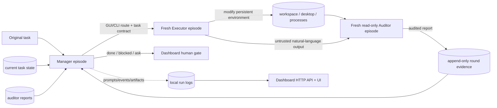
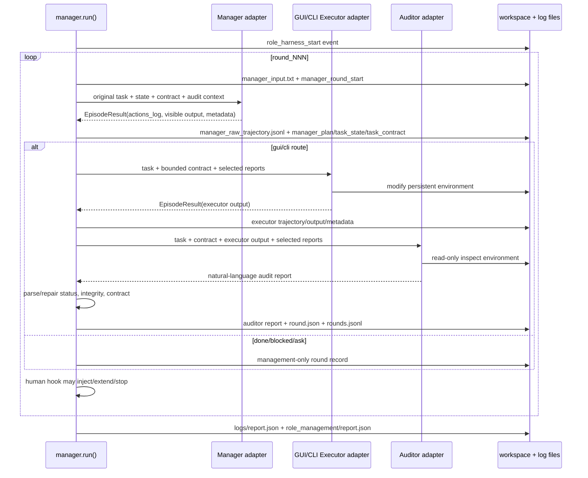

# 20260806_LongHorizon-Harness 技术架构分析

> 研究对象：阿里高德 DreamX Team 的 [AMAP-ML/LongHorizon-Harness](https://github.com/AMAP-ML/LongHorizon-Harness)
>
> 源码快照：`main` 在 2026-08-06 对应提交 [`24ad75c067b7abded492f7e343123e403741c612`](https://github.com/AMAP-ML/LongHorizon-Harness/commit/24ad75c067b7abded492f7e343123e403741c612)。
>
> 研究方法：以固定提交的仓库 README、`src/lh_harness` Python/JavaScript 源码和项目论文 [arXiv:2608.01964v1](https://arxiv.org/abs/2608.01964) 交叉核对。文中“源码观察”指该提交中直接可见的行为；“架构解释”是基于源码数据流的归纳，不把论文中的理想化描述误写成当前实现细节。

## 我能讲出来的版本（5 行）

1. LongHorizon-Harness 不是新的模型，而是包在 Claude Code/Codex 外面的**执行、状态管理和验收层**。
2. 每一轮是 Manager → Executor → Auditor；Manager 只看原任务、维护状态和审计报告，Executor 才能改环境，Auditor 只读验证。
3. `AgentAdapter` 只有一个异步入口 `run_episode()`；扩展时实现这个协议即可，CLI 后端只是把 prompt 文件、环境执行、超时和 JSONL 解析接起来。
4. “Context Refreshing”不是清空工作区，而是每个角色每轮启动一个新的、有预算边界的 Agent CLI 进程；跨轮只携带任务状态、任务契约和审计报告，不携带原始交互轨迹。
5. 运行产物是目录化的可恢复审计账本：`report.json`、`events.jsonl`、`rounds.jsonl`、每轮 prompt/output/metadata/JSONL trajectory，以及 Dashboard 通过 HTTP API 实时读取的同一批文件。

## 1. 系统定位与边界

README 将系统定位为长程任务的 execution、state-management、result-verification system：它不训练新模型，也不替换既有 Agent，而是在 Claude Code、Codex CLI 等后端外层协调角色边界、可信任务状态、跨轮推进和验收。

论文把问题抽象成：不要让一个持续增长的会话同时承担执行、状态记录和完成判断，而是把任务转成一系列独立审计的状态转移。源码中的关键边界如下：

| 边界 | 负责者 | 源码证据 |
|---|---|---|
| 原任务、稳定任务状态、下一步路由 | Manager | `manager.run()` 构造 `build_role_manager_prompt()`；Manager 没有 `Environment` 工具调用 |
| 真实环境修改 | GUI/CLI Executor | `_executor_binding()` 选择执行器，随后调用 `AgentAdapter.run_episode()` |
| 对刚完成子任务做环境核验 | 对应 Auditor | `build_role_auditor_prompt()` + `_auditor_report_with_format_repair()` |
| 运行时超时、取消、进程回收 | `Environment` + adapter | `LocalEnvironment.exec()`、`CommandAgentAdapter.run_episode()` |
| 轨迹解析和 UI 归一化 | `agent_logs.py` | Claude stream-json 与 Codex exec-json 被映射到统一 step kinds |
| 人工继续/停止/注入指令 | Dashboard gate | `dashboard/gate.py` 的 end-of-round `human_hook` |

### 1.1 高层结构



### 1.2 一个重要实现差异

论文方法章节将 `S_i` 描述为由 requirement、artifact、fact 组成的结构化任务状态，并用审计发现更新它；当前 `src/lh_harness` 的公开实现没有一个独立的 StateStore 或数据库。实际做法是：

- `manager.py` 在 Python 内存中维护 `current_task_state`、`current_task_contract` 和 `rounds`。
- Manager 输出中的“Current task state / 当前任务状态”和“Task contract / 任务契约”被正则提取后，成为下一轮状态。
- Auditor 报告作为 `ManagedRound.auditor_report` 保留；结构化 `AuditReport` 主要用于完成条件、完整性和契约对齐检查。
- 下一轮 Manager 重新读取这些报告，再决定如何更新状态。

因此，当前实现的“状态机”是**Manager 语言输出 + Python 轮次记录 + Auditor 报告解析**的组合，而不是一个由 Python 直接增删 requirement/artifact/fact 记录的显式数据库模型。

## 2. AgentAdapter 机制与扩展方式

### 2.1 最小协议：一个异步 episode 入口

源码文件：[`src/lh_harness/adapters/base.py`](https://github.com/AMAP-ML/LongHorizon-Harness/blob/24ad75c067b7abded492f7e343123e403741c612/src/lh_harness/adapters/base.py)。

```python
@runtime_checkable
class AgentAdapter(Protocol):
    async def run_episode(
        self,
        prompt: str,
        env: Environment,
        budget: EpisodeBudget,
        live_trajectory_path: str | None = None,
    ) -> EpisodeResult: ...
```

协议刻意没有暴露模型、消息历史或特定 SDK 类型。Harness 只要求适配器完成四件事：

1. 把本轮 prompt 交给 Agent 后端。
2. 通过 `Environment` 在目标环境中执行。
3. 遵守 `EpisodeBudget.max_duration_seconds`。
4. 返回统一的 `EpisodeResult`，至少含状态、原始动作/轨迹日志、错误、耗时和 metadata。

这使 Manager 不知道 Claude/Codex 的命令行参数，也不依赖某个厂商的消息对象。角色绑定发生在启动时，而不是每个轮次临时猜测：`manager_agent`、`gui_executor_agent`、`cli_executor_agent`、`gui_auditor_agent`、`cli_auditor_agent` 缺省时都沿 fallback 链回退到默认 `agent`。

### 2.2 内置实现：CommandAgentAdapter

源码文件：[`src/lh_harness/adapters/cli_agent.py`](https://github.com/AMAP-ML/LongHorizon-Harness/blob/24ad75c067b7abded492f7e343123e403741c612/src/lh_harness/adapters/cli_agent.py)。

`CommandAgentAdapter` 是一个命令行后端模板，核心流程如下：

```text
prompt(str)
  -> write_remote_text(env, unique prompt_path, prompt)
  -> substitute {prompt_path}/{timeout} into command_template
  -> cd workspace_path && shell command
  -> env.exec(..., tee_path=live_trajectory_path)
  -> status/visible output/error/metadata
  -> EpisodeResult
```

关键实现细节：

- prompt 文件名由 round/role 可读标签 + UUID 组成，避免多个 harness 或未来并发角色覆盖同一个 `prompt.md`。
- 命令模板采用显式字符串替换，而非 `str.format()`，因为 Codex 的内联 TOML 配置含有字面量大括号。
- `live_trajectory_path` 让 `LocalEnvironment` 把 stdout 按行 tee 到文件，Dashboard 可在 Agent 尚未退出时读取增长中的 JSONL。
- 退出码为 0 且未超时时返回 `done`；超时返回 `timeout`；其他非零退出返回 `error`。
- `actions_log` 保留完整 stdout；`assistant_visible_output` 由后端解析器抽出给 Manager/Auditor 使用；两者有意分离。
- stderr 只保留脱敏后的末尾片段；命令、API key、token、password 等模式会通过 `redact_secrets()` 脱敏。
- metadata 明确记录 `prompt_path`、`exit_code`、`termination_reason`、轨迹字符数、`trajectory_format=jsonl`、可见输出和 stderr 尾部。

### 2.3 ClaudeCodeAdapter 与 CodexAdapter 的差异

源码：[`claude_code.py`](https://github.com/AMAP-ML/LongHorizon-Harness/blob/24ad75c067b7abded492f7e343123e403741c612/src/lh_harness/adapters/claude_code.py)、[`codex.py`](https://github.com/AMAP-ML/LongHorizon-Harness/blob/24ad75c067b7abded492f7e343123e403741c612/src/lh_harness/adapters/codex.py)。

| 维度 | Claude Code | Codex |
|---|---|---|
| 启动形式 | `claude --print --output-format stream-json --verbose ...` | `codex exec --json --skip-git-repo-check ... -` |
| prompt 输入 | stdin 重定向到 prompt 文件 | stdin `-`，同样由 prompt 文件提供 |
| 可见输出解析 | `agent_logs.visible_output` 的 Claude stream-json 分支 | Codex `item.completed` 中 `agent_message` 的最后文本 |
| GUI/MCP | `--mcp-config` 原样传入 | Claude 风格 MCP JSON 转为 Codex `-c mcp_servers.*` 覆盖项 |
| endpoint | `ANTHROPIC_BASE_URL` | `model_providers.lh_harness` + `model_provider` TOML 覆盖 |
| 默认沙箱 | `--dangerously-skip-permissions` | 默认 `--dangerously-bypass-approvals-and-sandbox`，显式传 sandbox 时例外 |

CLI 工厂 [`cli.py::_build_agent`](https://github.com/AMAP-ML/LongHorizon-Harness/blob/24ad75c067b7abded492f7e343123e403741c612/src/lh_harness/cli.py) 当前只构造 `codex` 与 `claude_code` 两种内置 adapter；论文/README 对“自定义 AgentAdapter”开放的是库级扩展点，不等于当前 CLI 已自动发现任意第三方后端。

### 2.4 如何扩展一个新的 AgentAdapter

推荐两种层级：

#### 方案 A：实现最小 Protocol

适合已有 Python SDK、HTTP Agent 或自带异步运行循环的后端：

```python
from lh_harness.types import EpisodeBudget, EpisodeResult

class MyAdapter:
    async def run_episode(self, prompt, env, budget, live_trajectory_path=None):
        # 1. 在当前 episode 内创建新会话，不复用上一轮消息
        # 2. 用 prompt 和 env 完成一次有上限的执行
        # 3. 捕获 timeout/cancel/error
        # 4. 返回 EpisodeResult
        return EpisodeResult(
            status="done",
            actions_log="...",
            duration_ms=..., 
            metadata={"assistant_visible_output": "..."},
        )
```

建议至少兼容以下语义：

- `status` 只使用 `done`、`timeout`、`error`、`cancelled`。
- `actions_log` 保存可诊断的原始轨迹；不要只返回最后一句话。
- 如果原始轨迹会被 Dashboard 展开，metadata 里声明或复用 `agent_logs.py` 可识别的 JSONL 格式。
- `live_trajectory_path` 有值时，尽量增量写入，保证实时可见和超时后的部分证据不丢失。
- 不要把未审计的“完成”写进 `EpisodeResult` 之外的持久任务状态；Executor 结果只是交给 Auditor 的线索。

#### 方案 B：继承 CommandAgentAdapter

适合“已有 CLI + stdin prompt + stdout JSONL”后端。只需构造安全的 `command_template`、prompt 目录、workspace 路径和 visible-output parser。它会复用：

- 唯一 prompt 文件；
- 环境执行与超时；
- live tee；
- 进程返回码到 `EpisodeResult` 的映射；
- secret redaction；
- metadata 结构。

还需在 `agent_logs.py` 增加新后端的 `detect_format()`、`visible_output()` 和 `parse_trajectory()` 分支，才能让 Auditor 接收干净的自然语言输出、让 Dashboard 以统一 step schema 显示轨迹。

### 2.5 Adapter 扩展的契约风险

- **SDK session 复用风险**：如果自定义 adapter 在多次 `run_episode` 间复用对话对象，就破坏 fresh-context 语义。
- **环境与日志职责混淆**：Adapter 负责启动 Agent；环境读写/上传/下载/进程组清理由 `Environment` 负责，不能在 adapter 中绕过环境协议偷偷改路径。
- **可见文本与诊断轨迹混淆**：JSONL 原文可能含工具调用、图片、错误和 prompt 回显；Manager 应读取 `assistant_visible_output`，而不是直接把整条轨迹塞回下一轮上下文。
- **完成权越权**：Adapter 返回 `done` 只表示 episode 进程结束，不表示原任务完成；最终完成必须经过 Auditor + Manager 的 harness 级判断。

## 3. MEA（Manage–Execute–Audit）循环的具体 Python 数据流

主要源码：[`manager.py`](https://github.com/AMAP-ML/LongHorizon-Harness/blob/24ad75c067b7abded492f7e343123e403741c612/src/lh_harness/manager.py)、[`role_prompts.py`](https://github.com/AMAP-ML/LongHorizon-Harness/blob/24ad75c067b7abded492f7e343123e403741c612/src/lh_harness/role_prompts.py)、[`types.py`](https://github.com/AMAP-ML/LongHorizon-Harness/blob/24ad75c067b7abded492f7e343123e403741c612/src/lh_harness/types.py)。

### 3.1 运行初始化

`manager.run()` 接收：

```python
run(
    task: str,
    env: Environment,
    config: HarnessConfig,
    agent: AgentAdapter | None = None,
    auditor_agent: AgentAdapter | None = None,
    manager_agent: AgentAdapter | None = None,
    gui_executor_agent: AgentAdapter | None = None,
    cli_executor_agent: AgentAdapter | None = None,
    gui_auditor_agent: AgentAdapter | None = None,
    cli_auditor_agent: AgentAdapter | None = None,
    human_hook: Callable[...] | None = None,
)
```

启动时一次性解析角色 fallback，建立：

- `manager_budget`；
- `gui_executor_budget` / `cli_executor_budget`；
- `auditor_budget`；
- `log_dir/role_management/rounds`；
- `events.jsonl`；
- 内存 `rounds: list[ManagedRound]`；
- `current_task_state`、`current_task_contract`、`last_plan`、`round_index`。

然后写入 `role_harness_start` 事件，包含 variant、task 字符数、workspace/harness 路径、最大轮次和四类 episode budget。

### 3.2 每轮 Manager 阶段

每一轮创建 `round_NNN` 目录，并调用：

```python
manager_prompt = build_role_manager_prompt(
    task=task,
    rounds=rounds,
    round_index=round_index,
    task_state=current_task_state,
    task_contract=current_task_contract,
    language=config.prompt_language,
    max_history_chars=config.role_history_chars,
)
```

Manager prompt 的输入集合是：

1. 原始任务 `task`；
2. 稳定任务契约 `current_task_contract`；
3. 上一轮维护状态 `current_task_state`；
4. 既往 `ManagedRound.auditor_report` 格式化后的可信中间上下文；
5. harness protocol feedback（例如无效路由或错误完成声明）；
6. Dashboard/人工 gate 上一轮注入的高优先级指令。

它**没有** `env` 工具，也没有 raw trajectory。然后：

```text
_write_local(round_N/manager_input.txt)
_write_remote_round_text(..., manager_input.txt)
_append_event(manager_round_start)
manager_result = _run_role_episode(manager_agent, ...)
_save_role_result(round_N, "manager", manager_result)
```

Manager 可输出的路由由 `parse_role_manager_next_step()` 识别：

```text
Next: gui       / 下一步: GUI任务
Next: cli       / 下一步: CLI任务
Next: ask       / 下一步: 请示用户
Next: done      / 下一步: 完成
Next: blocked   / 下一步: 阻塞
```

自然语言输出经 `visible_output()` 取出后，先抽取：

- `plan_text`；
- `current_task_state`；
- `current_task_contract`；
- `related_report_refs`（如 `round_002`）。

再写入 `manager_plan.txt`、`task_state.txt`、`task_contract.txt` 和远端镜像，并记录 `manager_round_done`。

### 3.3 路由分支

#### `done`

`done` 不是 Manager 自己说了算。只有 `_latest_auditor_is_clean_complete(rounds)` 返回真才接受，具体同时要求最近有效 Auditor 报告：

```python
report.status == "complete"
report.integrity_status == "clean"
report.contract_audit_status == "aligned"
```

否则构造 synthetic harness feedback，标记 `invalid_completion`，把本轮作为一条管理记录写回下一轮，要求 Manager 继续安排可审计工作。

#### `blocked`

记录本轮 Manager 计划，不调用 Executor；随后交给 end-of-round human hook。没有 Dashboard hook 时直接以 `manager_blocked` 结束；有 hook 时可注入指令、追加轮次或停止。

#### `ask`

从 `问题:` / `Question:` 区段抽取问题与选项，记录本轮并创建人工 gate。用户答案在下一轮进入 Manager prompt，而不是伪装成 Auditor 事实。

#### `gui` / `cli`

通过 `_executor_binding()` 选对应 Executor 与预算，然后进入 Execute–Audit。

### 3.4 Execute 阶段

Executor prompt 由 `build_role_executor_prompt()` 构造，输入为：

- 原始任务；
- Manager 的 `plan_text`，即本轮子任务契约；
- `current_task_state`；
- `current_task_contract`；
- Manager 显式引用的相关 Auditor 报告；
- GUI 或 CLI 角色指令；
- 任务契约规则与最终状态 guard。

这里有一个很关键的**上下文选择器**：Executor 不接收全部历史报告，只接收 Manager 在计划中列出的 `round_NNN` 报告，且经过 `max_chars=config.role_verified_context_chars` 截断。

随后：

```text
executor_prompt.txt
executor_role_start
executor_result = _run_role_episode(..., executor_raw_trajectory.jsonl)
_save_role_result(...)
executor_output = _visible_output(executor_result)
executor_output.txt
executor_role_done
```

`executor_output` 只是未验证的自然语言结果；即使它声称“完成”，也只会作为 Auditor prompt 的定位线索。

### 3.5 Audit 阶段

Auditor prompt 输入：

- 原始任务；
- 当前任务状态和稳定契约；
- 本轮 Manager 子任务；
- Executor 自然语言输出（上限 `auditor_output_chars`）；
- Manager 引用的相关旧 Auditor 报告；
- GUI/CLI Auditor 的只读检查指令。

Auditor 运行后先由 `_auditor_report_with_format_repair()` 处理：

1. 如果运行失败或有硬运行时信号，直接产生 blocked runtime report。
2. 读取可见自然语言报告。
3. 报告前三个非空行必须是控制头：

   ```text
   Status: complete | incomplete | blocked
   Integrity: clean | suspect | violation
   Contract audit: aligned | unknown | needs_revision | invalid
   ```

4. 缺控制头时再开一次短的 format-repair episode；repair 只能重排原报告，不能重新使用工具或改环境。
5. `auditor_agent.py` 解析 status、integrity、contract、state summary、action guidance、artifact deletion declarations。
6. 如果 Auditor 在只读审计期间修改工作区，且监控检测到 mutation，报告被降级为 `blocked + violation`，必要时回滚审计前快照。
7. 有 blocking acceptance constraints 时，即使文本说 complete，也会被 completion guard 改为 incomplete。

本轮最终构造 `ManagedRound`：

```python
ManagedRound(
    round_index=round_index,
    next_step=next_step,
    plan_text=plan_text,
    executor_output=executor_output,
    auditor_report=auditor_report,
    harness_feedback=..., 
    task_state=current_task_state,
    task_contract=current_task_contract,
    related_report_refs=related_report_refs,
    executor_status=_episode_status(executor_result),
    auditor_status=auditor_status,
)
```

然后同时写：

- 本地 `rounds.jsonl`（一行一个 compact `ManagedRound` JSON）；
- 远端 `.harness/management/rounds/round_NNN/round.json`（缩进 JSON）；
- `managed_round_recorded` 和 `auditor_role_done` 事件。

最后调用 human hook。若继续，下一轮 Manager 只从 `rounds` 中的稳定字段和审计报告重新开始。

### 3.6 MEA 数据流总图



## 4. Context Refreshing 机制

### 4.1 论文语义：刷新的是 execution context，不是 environment

论文 2.1/2.3/2.4 的定义是：每个 Executor invocation 都是 fresh、budget-bounded episode；不接收此前轮次的 raw interaction trajectory 和 internal reasoning；episode 内仍可进行多次规划、工具调用、观察和修订。Auditor 同样从不接收 Executor raw trajectory，只接收必要的任务/契约/报告输入并直接检查环境。

源码实现把这个语义落实为“**每次 `run_episode()` 启动一个新的 CLI 进程**”：

- prompt 写入本轮唯一的临时文件；
- `env.exec()` 创建新的 subprocess session；
- 进程退出后只将 `EpisodeResult` 和持久化日志交给外层；
- 下一轮重新生成 prompt，不复用上一轮 Agent 的 message history。

### 4.2 跨轮保留什么

| 信息 | 是否进入下一轮 | 进入方式 |
|---|---:|---|
| 原始任务 | 是 | 每次 role prompt 的 `Original task` |
| Manager 维护的当前任务状态 | 是 | `current_task_state` / `task_state.txt` |
| 稳定任务契约 | 是 | `current_task_contract` / `task_contract.txt` |
| Auditor 报告 | 是 | Manager 默认看到全部；Executor/Auditor 只看到被引用的 round refs |
| harness protocol feedback | 是 | 只给 Manager，作为完成/路由修正信号 |
| 用户输入 | 是 | Dashboard gate 将其注入下一轮 Manager |
| Executor 自己的 raw trajectory | 否 | 只落盘用于诊断和 Dashboard 展开 |
| 上一轮 Agent 的内部 reasoning | 否 | 不进入 prompt |
| 上一轮完整 prompt | 否 | 只保存为 artifact，不自动回灌 |

源码层面还有三道长度闸门：

- `role_history_chars`：Manager 审计历史总长度上限；
- `role_verified_context_chars`：Executor/Auditor 选择性审计上下文上限；
- `auditor_output_chars`：传给 Auditor 的 Executor 输出上限；
- Auditor 报告自身通过 `COMPACT_REPORT_CHARS=2500` 压缩，保留头尾。

这不是简单的“把所有历史摘要拼起来”，而是**状态字段 + 按引用选择审计报告 + 头尾保留的有界上下文**。

### 4.3 环境为什么仍能连续

Context refresh 不会重置 `workspace`、桌面应用、文件、进程或 VM。`LocalEnvironment` 的 subprocess 运行目录统一为 `workspace_path`，而 `upload/download` 操作同一持久路径；因而：

```text
fresh agent memory/context
        + persistent environment state
        + audited state carried outside the agent
        = recoverable long-horizon execution
```

这也是为什么“Executor raw trajectory 不跨轮传递”不会丢掉已完成工作：工作本身存在环境中，只有经过 Auditor 确认的语义事实才进入下一轮状态。

### 4.4 失败与刷新后的恢复

- Executor 超时：`LocalEnvironment` 终止整个 process group，保留已 tee 到文件的 stdout 前缀；Manager 获得 timeout 状态，下一轮仍可根据 Auditor/环境状况继续。
- Auditor 输出不可解析：先走 format-repair；repair 不合格则保守 blocked/suspect/unknown，而不是猜测完成。
- Manager 输出 `done` 但没有最近 clean/complete/aligned 报告：生成 harness feedback，强制下一轮重新管理。
- Auditor 修改环境：记录 mutation，报告降级，必要时恢复审计前快照，防止“审计者自己修好了再宣称通过”。

## 5. Dashboard 与 run log 格式

### 5.1 运行目录

CLI [`_run_command()`](https://github.com/AMAP-ML/LongHorizon-Harness/blob/24ad75c067b7abded492f7e343123e403741c612/src/lh_harness/cli.py) 为每次运行创建隔离目录：

```text
<runs-root>/<run-id>/
├── workspace/                         # Executor/Auditor 共用的持续环境
│   └── .harness/management/...        # 远端/工作区内的状态镜像
├── logs/
│   ├── report.json                    # 最终 Harness 报告
│   └── role_management/
│       ├── events.jsonl               # 生命周期事件流
│       ├── rounds.jsonl               # 已完成轮次 append-only ledger
│       ├── management_transcript.txt  # 面向人阅读的轮次串联文本
│       ├── approvals.jsonl            # Dashboard 人工 gate 快照
│       ├── report.json                 # role-management 报告副本
│       └── rounds/
│           └── round_001/             # 每轮 prompt/output/trajectory/artifacts
└── tmp/
    └── prompts/                       # 本轮各角色的唯一 prompt 文件
```

每轮本地目录常见文件：

```text
round_NNN/
├── manager_input.txt
├── manager_raw_trajectory.jsonl
├── manager_metadata.json
├── manager_plan.txt
├── task_state.txt
├── task_contract.txt
├── executor_prompt.txt
├── executor_raw_trajectory.jsonl
├── executor_metadata.json
├── executor_output.txt
├── auditor_input.txt
├── auditor_raw_trajectory.jsonl
├── auditor_metadata.json
├── auditor_report.txt
├── auditor_format_repair_input.txt             # 仅触发 repair 时
├── auditor_format_repair_raw_trajectory.jsonl  # 仅触发 repair 时
└── auditor_format_repair_metadata.json        # 仅触发 repair 时
```

`_save_role_result()` 对 live trajectory 有保护：如果最终 stdout 为空或比已经 tee 的文件短，不会覆盖已有的完整前缀。这保证 timeout/cancel 后 Dashboard 仍能展示进程已经产生的 JSONL。

### 5.2 `report.json` 最终结构

`manager._final_report()` 生成 schema version 2 的 JSON，核心字段：

```json
{
  "schema_version": 2,
  "variant": "lh_harness_role_managed",
  "mode": "role_management",
  "status": "complete | incomplete | blocked | cancelled",
  "task": "original task",
  "completion_satisfied": true,
  "completion_authority": "manager_with_role_auditors",
  "rounds_run": 3,
  "max_rounds": 30,
  "abort_reason": "",
  "last_plan": "...",
  "current_task_state": "...",
  "current_task_contract": "...",
  "latest_auditor_report": "...",
  "rounds": ["ManagedRound asdict ..."],
  "elapsed_seconds": 123.456
}
```

注意 `completion_authority` 明确表明最终状态不是最后一个 Executor 的自报，而是 Manager + role Auditors 的 Harness 决策。

### 5.3 `ManagedRound` / `rounds.jsonl`

每一行是一个 JSON 对象，对应 `ManagedRound` dataclass：

```json
{
  "round_index": 1,
  "next_step": "cli",
  "plan_text": "...",
  "executor_output": "...",
  "auditor_report": "Status: incomplete\nIntegrity: clean\nContract audit: aligned\n...",
  "harness_feedback": "",
  "task_state": "...",
  "task_contract": "...",
  "related_report_refs": ["round_001"],
  "executor_status": {
    "status": "done",
    "error": null,
    "duration_ms": 1234,
    "agent_done": null,
    "exit_code": 0,
    "runtime_signals": null
  },
  "auditor_status": {
    "status": "done",
    "format_repair_attempted": false
  }
}
```

`rounds.jsonl` 是 append-only 的本地账本；远端 `.harness/management/rounds/round_NNN/round.json` 使用缩进 JSON，方便在任务 VM 内检查。最终 `report.json` 再将所有 `ManagedRound` 作为数组汇总。

### 5.4 `events.jsonl`

事件使用“一个 JSON 对象一行”的 append-only 格式，最小公共字段是：

```json
{"ts": 1780000000.123, "event": "manager_round_start", "round": 1, "prompt_chars": 8234}
```

常见事件：

- `role_harness_start` / `role_harness_done` / `role_harness_cancelled`；
- `manager_round_start` / `manager_round_done`；
- `executor_role_start` / `executor_role_done`；
- `auditor_role_start` / `auditor_role_done`；
- `auditor_format_repair_start` / `auditor_format_repair_done`；
- `managed_round_recorded`；
- `human_instructions_injected`；
- `human_continue_after_finish`。

事件不是状态真相的唯一来源。Dashboard 会把 `events.jsonl`、`rounds.jsonl`、最终报告和正在写入的 `round_NNN` 目录合并：即使轮次还没有完成、`rounds.jsonl` 尚未追加，也能通过目录中的 `manager_plan.txt`、metadata 和 trajectory 文件显示 in-progress 状态。

### 5.5 原始轨迹 JSONL 与归一化 step schema

`agent_logs.py` 对两类后端做解析：

- Claude：`system`、`assistant`、`user`、`result` stream-json；
- Codex：`thread.started`、`turn.started`、`item.started`、`item.completed`、`turn.completed`、`turn.failed` 等 exec-json。

Dashboard 不直接理解后端事件，而是统一渲染以下 step kinds：

```text
session       # 模型、cwd、MCP server、tool count、thread id
thinking      # reasoning/thinking
text          # assistant text
 tool_use     # shell/apply_patch/MCP/web_search/todo_list 等
 tool_result  # 输出、错误、内嵌图片
result        # 最终回答、duration、turns、token/cost metadata
```

Claude 的 `result` 往往复制最后一个 assistant text，解析器会去重；Codex 的 `turn.failed` 被归一为错误 result，并可进入 runtime-signal 处理路径。截图以 data URL 保留在 `tool_result.images`，Dashboard 可直接展示，不需要另写图片文件。

### 5.6 Dashboard HTTP API 与实时模型

源码：[`dashboard/server.py`](https://github.com/AMAP-ML/LongHorizon-Harness/blob/24ad75c067b7abded492f7e343123e403741c612/src/lh_harness/dashboard/server.py)、[`dashboard/state.py`](https://github.com/AMAP-ML/LongHorizon-Harness/blob/24ad75c067b7abded492f7e343123e403741c612/src/lh_harness/dashboard/state.py)、[`dashboard/static/app.js`](https://github.com/AMAP-ML/LongHorizon-Harness/blob/24ad75c067b7abded492f7e343123e403741c612/src/lh_harness/dashboard/static/app.js)。

| 方法 | 路径 | 返回/作用 |
|---|---|---|
| GET | `/`、`/static/*` | 静态 Dashboard 页面/样式/脚本 |
| GET | `/api/state` | 当前 run、report、rounds、events、approvals、pending injections、server time |
| GET | `/api/round/{n}` | 本轮 artifact 文件名列表 |
| GET | `/api/round/{n}/{name}` | 读取单个 artifact 原文 |
| GET | `/api/round/{n}/trajectory/{role}` | 读取并归一化某角色 trajectory |
| POST | `/api/approvals/{id}/resolve` | resolve/cancel 人工 gate，附 user input |
| POST | `/api/inject` | 把非阻塞人工指令排队，下一轮 Manager 前注入 |
| POST | `/api/select-run` | 在 `runs_root` 下切换被浏览 run |

Dashboard 是 Python 标准库 `ThreadingHTTPServer` + 静态 JS，不依赖数据库或前端框架。前端每 2 秒请求 `/api/state`；通过 round role trajectory 文件的字节大小检测是否增长，再请求具体 trajectory。`DashboardState` 每次从磁盘 fresh read，因此进程内 UI 状态和磁盘日志之间的边界清晰：

- 磁盘：运行事实、轨迹、报告、人工审批历史；
- 内存：当前 pending approval 和待注入指令队列；
- 审批创建/resolve 后会 append 到 `approvals.jsonl`，所以人工操作可以在运行结束后复盘。

### 5.7 人工 gate 的数据流

`dashboard/gate.py` 把 Manager 每轮结束时传入的 context 分类为：`completed`、`max_rounds`、`needs_input`、`needs_human`、`repeated_failure`。命中后创建 Approval：

```json
{
  "approval_id": "12-char-hex",
  "title": "...",
  "message": "...",
  "options": [{"value": "continue", "label": "继续运行", "style": "primary"}],
  "answers": ["是", "否"],
  "context": {
    "phase": "end_of_round",
    "trigger": "needs_input",
    "round_index": 2,
    "question": "..."
  },
  "status": "pending | resolved",
  "action": "continue | stop",
  "user_input": "..."
}
```

“继续”可以延长 `round_budget`；用户输入被拼到 `carryover_instructions`，在下一轮 Manager prompt 中以高优先级文本出现。它不会直接篡改 `task_state`，仍由 Manager 重新解释。

## 6. 关键设计判断与可复用经验

### 6.1 深模块在哪里

- `AgentAdapter` 是窄接口：把后端差异压缩成一次 episode 调用。
- `Environment` 是另一条窄接口：把本地/远端执行、截图、上传下载和 tee 能力抽象出来。
- `manager.run()` 是状态转移的深模块：角色绑定、prompt 构造、路由、审计门禁、记录、人工续跑都集中在这里。
- `agent_logs.py` 是格式隔离层：后端 JSONL 变化不应扩散到 Manager 和 Dashboard。
- `DashboardState` 是读模型：从 append-only 日志和 live 目录合并出 UI snapshot，不把 UI schema 反向耦合进 MEA loop。

### 6.2 设计中的三条信任边界

1. **Executor output ≠ verified fact**：Executor 的自然语言只供 Auditor 定位。
2. **Auditor report ≠ automatic state mutation**：Auditor 提供证据，Manager 决定怎样更新稳定状态。
3. **Agent process done ≠ task complete**：进程结束、无错误、最后一句“完成”都不足以满足最终完成条件。

### 6.3 当前实现的可见取舍

- 优点：协议窄、后端可替换；日志可追溯；超时和取消保留部分轨迹；Dashboard 不依赖数据库；fresh context 明确限制上下文膨胀。
- 成本：每轮都要重新启动角色 Agent；Auditor 带来明显额外 token/时间成本；Manager 必须通过自然语言维护状态，结构化任务状态的类型安全弱于真正 StateStore。
- 风险：若 Auditor 报告或 Manager 状态文本过长，截断会损失中间证据；若自定义 adapter 不实现统一 trajectory parser，Manager 可能拿不到可见输出；若状态抽取正则无法识别模型格式，路由会变成 `invalid` 并触发修复轮。

## 7. 适合二次开发的切入点

| 需求 | 推荐切入文件 | 不建议的做法 |
|---|---|---|
| 接入新 Agent CLI | 新建 `adapters/<backend>.py`，继承 `CommandAgentAdapter` | 在 `manager.py` 中写厂商分支 |
| 接入新 SDK/HTTP Agent | 实现 `AgentAdapter.run_episode()` | 把 SDK session 放到跨轮全局变量 |
| 支持新轨迹格式 | `agent_logs.py` 增加 detect/visible/trajectory 三件套 | 让 Dashboard 直接解析厂商 JSON |
| 增加角色 | `manager.run()` 的角色绑定、CLI role config、role prompts、types | 复用一个角色的 prompt 而不声明权限边界 |
| 增加审计字段 | `AuditReport` + `auditor_agent.py` 控制头/解析 | 只在 UI 中显示未进入停止条件的字段 |
| 更换日志后端 | 保持 `report.json`/JSONL 兼容，替换 storage 读写层 | 让 Dashboard 依赖内存对象，失去运行后复盘 |
| 强化结构化状态 | 在 Manager 与 Auditor 之间加入显式 StateStore，但保留 `ManagedRound` 兼容 | 直接把 Manager 自报当真相 |

## 8. 证据索引

### 仓库源码（固定提交）

- [README.md](https://github.com/AMAP-ML/LongHorizon-Harness/blob/24ad75c067b7abded492f7e343123e403741c612/README.md)：系统定位、三角色、fresh context、运行目录、Dashboard 说明。
- [`src/lh_harness/adapters/base.py`](https://github.com/AMAP-ML/LongHorizon-Harness/blob/24ad75c067b7abded492f7e343123e403741c612/src/lh_harness/adapters/base.py)：`AgentAdapter` Protocol。
- [`src/lh_harness/adapters/cli_agent.py`](https://github.com/AMAP-ML/LongHorizon-Harness/blob/24ad75c067b7abded492f7e343123e403741c612/src/lh_harness/adapters/cli_agent.py)：prompt、命令、超时、tee、metadata、脱敏。
- [`src/lh_harness/adapters/claude_code.py`](https://github.com/AMAP-ML/LongHorizon-Harness/blob/24ad75c067b7abded492f7e343123e403741c612/src/lh_harness/adapters/claude_code.py) / [`codex.py`](https://github.com/AMAP-ML/LongHorizon-Harness/blob/24ad75c067b7abded492f7e343123e403741c612/src/lh_harness/adapters/codex.py)：内置后端差异。
- [`src/lh_harness/manager.py`](https://github.com/AMAP-ML/LongHorizon-Harness/blob/24ad75c067b7abded492f7e343123e403741c612/src/lh_harness/manager.py)：完整 MEA loop、轮次文件与最终报告。
- [`src/lh_harness/role_prompts.py`](https://github.com/AMAP-ML/LongHorizon-Harness/blob/24ad75c067b7abded492f7e343123e403741c612/src/lh_harness/role_prompts.py)：Manager/Executor/Auditor prompt、报告引用与截断。
- [`src/lh_harness/auditor_agent.py`](https://github.com/AMAP-ML/LongHorizon-Harness/blob/24ad75c067b7abded492f7e343123e403741c612/src/lh_harness/auditor_agent.py)：控制头、完整性、契约、格式修复和 mutation guard。
- [`src/lh_harness/types.py`](https://github.com/AMAP-ML/LongHorizon-Harness/blob/24ad75c067b7abded492f7e343123e403741c612/src/lh_harness/types.py)：`EpisodeResult`、`AuditReport`、`ManagedRound`、`HarnessConfig`。
- [`src/lh_harness/agent_logs.py`](https://github.com/AMAP-ML/LongHorizon-Harness/blob/24ad75c067b7abded492f7e343123e403741c612/src/lh_harness/agent_logs.py)：Claude/Codex JSONL 与统一 trajectory step schema。
- [`src/lh_harness/environment/base.py`](https://github.com/AMAP-ML/LongHorizon-Harness/blob/24ad75c067b7abded492f7e343123e403741c612/src/lh_harness/environment/base.py) / [`local.py`](https://github.com/AMAP-ML/LongHorizon-Harness/blob/24ad75c067b7abded492f7e343123e403741c612/src/lh_harness/environment/local.py)：环境协议、子进程、live tee、超时/进程组回收。
- [`src/lh_harness/dashboard/state.py`](https://github.com/AMAP-ML/LongHorizon-Harness/blob/24ad75c067b7abded492f7e343123e403741c612/src/lh_harness/dashboard/state.py) / [`server.py`](https://github.com/AMAP-ML/LongHorizon-Harness/blob/24ad75c067b7abded492f7e343123e403741c612/src/lh_harness/dashboard/server.py)：磁盘读模型与 HTTP API。
- [`src/lh_harness/dashboard/gate.py`](https://github.com/AMAP-ML/LongHorizon-Harness/blob/24ad75c067b7abded492f7e343123e403741c612/src/lh_harness/dashboard/gate.py)：人工 gate、继续/停止/指令注入。
- [`src/lh_harness/cli.py`](https://github.com/AMAP-ML/LongHorizon-Harness/blob/24ad75c067b7abded492f7e343123e403741c612/src/lh_harness/cli.py)：run 目录、角色配置、Dashboard 启动和 adapter 工厂。

### 论文

- [arXiv abstract](https://arxiv.org/abs/2608.01964)：问题定义、贡献与版本信息。
- [arXiv HTML v1](https://arxiv.org/html/2608.01964v1)：第 2 节 MEA 数学定义、fresh-context executor、read-only auditor、实验配置。
- [论文 Figure 2](https://arxiv.org/html/2608.01964v1#S0.F1)：Manager/Executor/Auditor 状态转移概览。

### 版本核对备注

论文的方法描述还提到 OpenClaw 作为可接入 backend；固定提交的主包 `src/lh_harness/adapters/__init__.py` 当前只导出 `AgentAdapter`、`ClaudeCodeAdapter`、`CodexAdapter`，并且 CLI 工厂也只处理 Claude/Codex。仓库中的 `eval/` 下存在冻结兼容副本和评测集，不应把它们误认为主运行包的当前 adapter 注册表。
