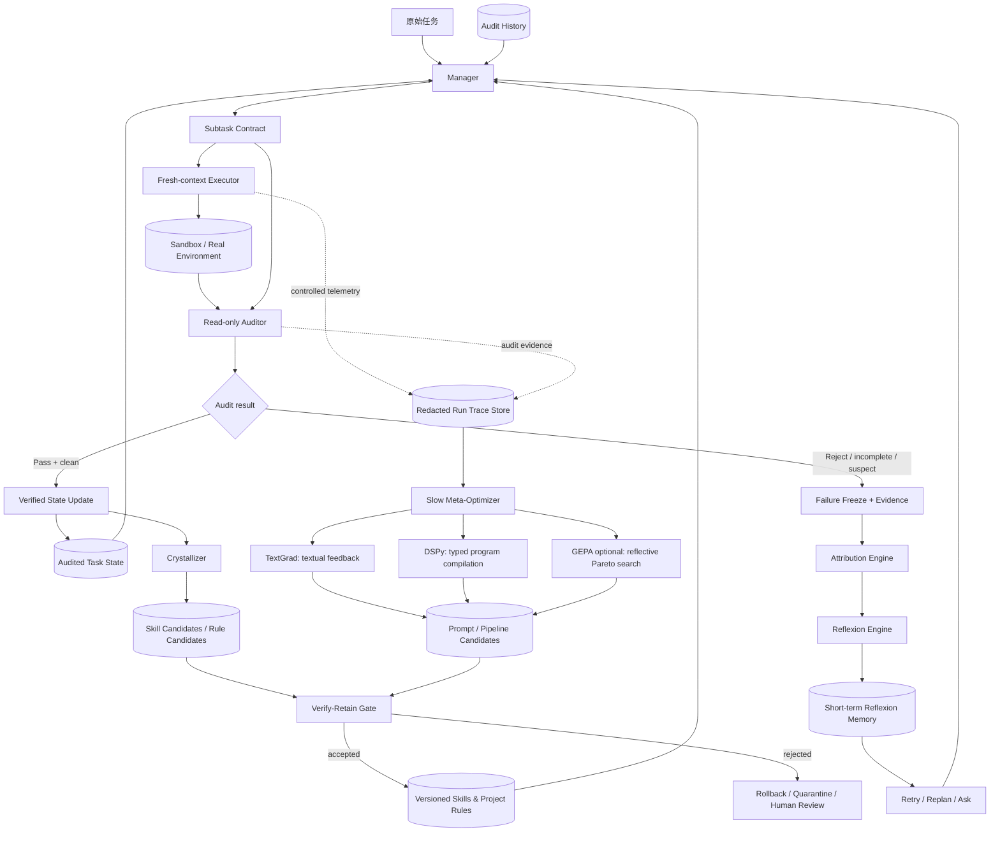

# LongHorizon-Harness（lh-harness）MEA 自我进化整合蓝图

> **报告日期**：2026-08-06  
> **研究对象**：LongHorizon-Harness 的 Manage–Execute–Audit（MEA）架构  
> **目标**：把 Self-Evolution & Feedback Loops 深度接入 MEA，同时保持“状态只能由独立审计事实推进”的核心不变量。  
> **证据口径**：`[事实]` 来自官方论文、官方仓库或项目网站；`[方案]` 是本报告针对集成的设计建议，不代表 lh-harness 当前已经实现。

---

## 1. 结论先行

推荐采用**双平面、双时间尺度**架构：

- **运行平面（Runtime Plane）**：保持原生 MEA。Manager 只读持久任务状态；Executor 在 fresh context 中执行且是唯一写环境者；Auditor 只读检查环境；跨轮次只写入审计报告支持的事实。
- **学习平面（Learning Plane）**：在审计拒绝后做归因与 Reflexion，在审计通过后生成技能候选，在多轮任务积累后由 TextGrad/DSPy/GEPA 做离线或低频元优化。学习平面可以提出候选，但不能直接伪造任务完成事实、绕过 Auditor 或直接改生产规则。
- **快速内环**：`Reject → 冻结/取证 → 归因 → 反思 → 重规划或重试 → 再审计`。
- **慢速外环**：`审计轨迹 → 候选技能/规则与 Prompt 候选 → 留出集评估 → Verify–Retain → Canary → 晋级或回滚`。

核心判断：**Reflexion 应修复当前 subtask；技能结晶应沉淀可复用知识；TextGrad/DSPy 应优化角色提示与编排参数。三者不能混成一个“让 Agent 自己改一切”的循环。**

---

## 2. 基线：lh-harness 已经提供的 MEA 不变量

### 2.1 官方架构事实

[事实] LongHorizon-Harness 将长程执行重写为一系列“独立审计的状态转移”：任务状态显式存放在执行上下文之外，只有环境中独立验证的事实才能推进状态；每轮由 Manager 生成一个有边界的 subtask contract，fresh-context Executor 执行，read-only Auditor 独立检查，再由 Manager 决定 `execute / done / blocked / ask`。[1][2]

[事实] Manager 不直接观察环境；Executor 是有意修改环境的唯一角色；Auditor 不接收 Executor 的原始轨迹与内部推理，只能用只读工具对照验收条件检查环境。Executor 的自报结果不能直接使任务状态变成 completed。[1]

[事实] 官方方法将审计报告作为跨轮次持久信息，丢弃每轮 Executor 的原始交互轨迹，以避免上下文腐烂与错误自我评估跨轮传播。[1] 官方网站同时说明每次运行会产生带审计轨迹的 `runs/<run-id>/` 运行目录。[2] 这意味着自我进化要新增**受控、可脱敏、可选择性保留的学习遥测**，而不能默认把原始执行上下文重新塞回运行平面。

[事实] 论文报告在相同骨干与执行后端下，WeaveBench PassRate 由 51.8% 提升到 80.7%，Terminal-Bench 2.1 由 69.7% 提升到 77.2%，OSWorld 2.0 binary completion 由 2.8% 提升到 8.3%；实验设置为 Executor 每轮最多 1800 秒、Manager/Auditor 各 300 秒、最多 25 个 MEA round。[1] 这些数字证明 MEA 的状态与审计解耦有效，但**不证明**自我进化机制已经存在。

### 2.2 集成时必须保留的边界

| 不变量 | 集成后的硬约束 |
|---|---|
| 审计事实优先 | Reflexion、技能候选、Prompt 候选都不能直接写入 `completed` 状态；只有 Auditor 的环境证据可以推进任务状态。 |
| 角色隔离 | Attribution/Reflexion 可以读取受控的执行遥测，但不能把诊断文本伪装成 Auditor 证据。 |
| Auditor 只读 | Auditor 不得为了“帮助修复”而改文件、运行状态改变命令或修改验收标准。 |
| fresh context | 重试 Executor 只接收当前 contract、相关审计证据、已批准的反思摘要和匹配的技能；不接收无界原始历史。 |
| 可回滚 | 学习平面的所有写入先进入候选区、版本库或隔离分支，经回归与安全门禁后再晋级。 |
| 预算有界 | Reflexion、外环优化、技能检索都受 token、时间、轮次和候选数量上限控制。 |

---

## 3. 目标架构：MEA 外挂 Evolution Plane



### 3.1 两个关键分离

1. **任务状态与学习状态分离**：`Audited Task State` 是完成任务所需的事实；`ReflexionMemory`、`SkillCandidate`、`PromptCandidate` 是学习假设。后者必须带 provenance、置信度和版本，不得被 Manager 当作已验证事实。
2. **运行内环与离线外环分离**：一次 Reject 只触发局部诊断和有限修复；TextGrad/DSPy 不应在每次 Reject 后立即改生产 Prompt，否则单个异常会引起全局漂移。

---

## 4. Auditor 否决：如何触发 Reflexion 与反思归因

### 4.1 先规范化拒绝信号

[事实] lh-harness Auditor 的报告包含三类信息：完成状态 `complete / incomplete / blocked`，完整性状态 `clean / suspect / violation`，以及有证据支撑的已验证事实与剩余缺口。[1]

[方案] 不要只使用一个布尔值 `Reject`，建议将审计结果规范化为：

```text
AuditDecision {
  completion: complete | incomplete | blocked,
  integrity: clean | suspect | violation,
  reason_codes: [missing_acceptance, wrong_artifact, test_failure,
                 unauthorized_mutation, environment_error, contract_error],
  evidence_refs: [...],
  confidence: 0..1,
  retryability: retry_same_contract | replan | ask_user | stop
}
```

触发策略：

- `incomplete + clean`：优先进入 Reflexion，属于可修复的执行缺口。
- `complete + suspect`：先二次只读审计或人工复核，不能直接写入完成状态。
- `incomplete + violation` 或发现未授权变更：冻结环境、隔离产物，禁止盲目重试；需要回滚或人工介入。
- `blocked`：若是缺权限、缺输入或外部依赖，不应让 Executor 继续重复；转 `ask_user` 或 `blocked`。
- 纯风格警告、非任务相关 warning：记录为 soft feedback，不触发重试。

### 4.2 拒绝后的控制流

1. **Freeze**：锁定当前 round 的 sandbox、diff、命令摘要、进程/文件/应用状态和 Auditor 证据；禁止反思过程覆盖现场。
2. **Evidence normalization**：把自然语言审计意见映射为结构化 reason code，并为每条结论绑定证据引用。先用确定性检查器（exit code、测试结果、文件 hash、schema、权限变化）压缩不确定性，再调用 LLM 做语义归因。
3. **Attribution**：判断问题属于 contract、Manager、Executor、环境/工具、Auditor 或外部依赖；输出可证伪的因果假设，而不是看似精确但无证据的“责任百分比”。
4. **Reflexion**：将失败转换成一条短、可行动、与下一轮相关的 verbal lesson。Reflexion 原论文的核心是从环境反馈生成语言反馈，并将反思写入 episodic memory，不更新模型权重。[3]
5. **Decision**：由 Manager 基于审计事实和归因建议选择 `retry_same_contract`、`replan`、`ask_user` 或 `stop`。Reflexion 只能提出下一步，不得自行推进任务状态。
6. **Fresh retry**：重新启动 bounded Executor，只注入当前 contract、相关证据、经筛选的反思、匹配技能和回滚后的环境快照；继续由 Auditor 独立判定。

### 4.3 反思归因记录

建议将运行态记忆设计为短期、可过期的记录，而不是把全文塞入 Prompt：

```yaml
reflexion_record:
  id: ref-20260806-001
  task_id: task-...
  round: 4
  contract_id: contract-...
  outcome: rejected
  reason_codes: [missing_acceptance, test_failure]
  evidence_refs: [audit-004, test-log-004]
  suspected_owner: executor | manager | contract | environment | auditor | external
  causal_hypothesis: "Executor 修改了实现，但未覆盖 contract 指定的边界输入。"
  confidence: medium
  actionable_lesson: "先从 acceptance criteria 生成边界测试，再修改实现；不要只运行 happy path。"
  next_experiment: "在同一 checkpoint 上补充边界测试并重新审计。"
  ttl: 3 rounds
```

**归因原则**：

- 归因必须引用实际证据；没有证据时输出 `unknown`，触发 `replan` 或 `ask_user`，而不是编造解释。
- 同一拒绝重复出现时，升级策略：第二次优先改变假设或 contract；第三次进入熔断，不再重复相同 Prompt。
- 反思内容要区分“错误事实”“修复动作”“适用范围”。否则一句偶然经验会被错误泛化到所有项目。
- Auditor 不应读取 Executor 的隐藏推理；但独立的 Attribution Engine 可以读取**经脱敏的操作轨迹**来做诊断。诊断结果仍是学习提示，不能成为审计证据。

### 4.4 熔断与恢复

建议默认每个 contract 最多 3 次局部修复；每次必须满足“假设发生变化”或“证据发生变化”。达到上限后：

- 回到最近一个 clean checkpoint；
- 归档 `AuditDecision + Attribution + Reflexion`；
- 让 Manager 重写 contract 或请求用户补充信息；
- 若完整性为 violation，直接进入人工复核，不做自动重试。

不建议无条件执行 `git checkout .`：它可能删除用户在任务开始前已有的未提交工作。应使用任务专属 worktree、overlay snapshot 或带文件清单的可逆 checkpoint。

---

## 5. 成功 Trajectory 如何晶体化为 SKILL.md 与项目规则

### 5.1 先解决官方“丢弃原始轨迹”的张力

[事实] lh-harness 为降低跨轮上下文负担，会在 round 结束后丢弃 Executor 原始交互轨迹，跨轮保留任务状态与审计报告。[1] [事实] 官方网站说明运行目录具有审计轨迹。[2]

[方案] 增加一个**显式开启的学习遥测钩子**：在 Executor 结束前，由 Harness 生成脱敏的 `LearningTrace`，只保留可复用决策与证据，不保留隐藏推理、凭据、完整屏幕内容或无关命令输出。最低字段：

```yaml
learning_trace:
  task_family: "repo-level bug fix"
  contract: {goal, acceptance_criteria, constraints}
  state_before_hash: ...
  actions: [{tool, normalized_intent, target, result_class}]
  rejected_attempts: [{reason_codes, evidence_refs, lesson}]
  successful_delta: {artifacts, tests, verified_facts}
  audit_refs: [audit-001, audit-002]
  environment: {os, runtime, repo_fingerprint}
  cost: {rounds, latency_ms, tokens}
```

这是**审计与学习的可追溯摘要**，不是把原始上下文重新变成长期记忆。

### 5.2 结晶分层

| 层级 | 产物 | 何时产生 | 作用 | 是否自动进入运行时 |
|---|---|---|---|---|
| L0 | `ReflexionMemory` | 每次拒绝 | 当前 contract 的临时避坑 | 是，限 TTL |
| L1 | `SkillCandidate` | Pass 且有可解释修正路径 | 待验证经验 | 否，先隔离 |
| L2 | `SKILL.md` 条目 | 候选通过回放、反例和安全校验 | 场景化操作技能 | 是，按检索匹配 |
| L3 | 项目规则 | 多个任务复用后抽象出的稳定不变量 | 全局约束与禁忌 | 是，始终优先于技能 |

### 5.3 结晶触发条件

不要把“一次 Pass”直接写成全局规则。推荐：

- **候选触发**：Auditor `complete + clean`，且轨迹包含一次以上有效修正，或者任务被标记为高新颖度；立即生成 `SkillCandidate`。
- **晋级 SKILL.md**：至少在两个独立任务/不同输入上复用成功，且没有已知反例；通过回放测试和安全扫描。
- **晋级项目规则**：同一不变量跨多个技能反复出现，并且能够写成明确、可审计、低歧义的约束；需要人工批准或受保护的合并流程。
- **淘汰**：在连续窗口内复用失败、引入额外轮次、提高误拒绝率或与新项目状态冲突时降级为候选或撤销。

阈值是工程建议，不是上述论文的实验结论；应通过项目数据校准。

### 5.4 `SKILL.md` 的推荐结构

```markdown
---
name: repo-boundary-test-before-edit
scope: python repository / bug-fix contracts
status: candidate | active | deprecated
confidence: 0.0-1.0
provenance: [task-id, audit-id, replay-id]
version: 1
---

## Trigger
什么样的 contract、错误码或环境状态触发本技能。

## Preconditions
依赖、权限、文件范围、不可修改对象。

## Procedure
最小化、可复现的动作序列；避免绑定偶然路径。

## Verification
必须由 Auditor 独立执行的检查，以及通过标准。

## Pitfalls
已观察到的失败模式与不适用条件。

## Evidence
成功复用任务、审计报告、回放结果、最后验证时间。
```

### 5.5 SKILL 与项目规则的边界

- **SKILL.md**：回答“在某类场景下怎样做”，通过检索按需注入 Executor/Manager。
- **项目规则**：回答“无论何时都不能违反什么”，例如不可修改受保护目录、必须运行的验证、权限与数据边界。规则应短、稳定、可机械检查。
- 经验性命令、一次性路径、模型偏好和未验证的因果解释不能直接进入全局规则。
- Agent 只能提交候选 patch；不能自行修改安全规则、审计器实现、权限配置或忽略文件。所有规则变更都走版本化评审和 Verify–Retain。

---

## 6. TextGrad / DSPy 驱动的自优化飞轮

### 6.1 为什么外环不能只看最终成功率

单一 scalar reward 会掩盖“为什么失败”：是 Manager 拆解错误、Executor 误操作、Auditor 过严，还是环境本身不可用。GEPA 的官方说明明确强调，读取完整执行轨迹、错误信息、性能数据并生成可操作诊断，比只保留标量奖励更适合文本参数优化。[7]

因此外环的 evaluator 至少应返回：

```text
utility = verified_completion
        - λ1 * audit_false_reject
        - λ2 * retry_count
        - λ3 * token_cost
        - λ4 * latency
        - λ5 * integrity_violation
```

其中 `verified_completion` 必须来自环境 Auditor；`audit_false_reject` 需要由人工标注、第二审计器或确定性 oracle 校准，不能由同一个被优化的 Auditor 自评。

### 6.2 TextGrad：局部、可解释的文本反馈更新

[事实] TextGrad 将自然语言反馈当作“文本梯度”，提供类似 PyTorch 的变量、loss、反向传播与文本优化器；官方示例展示了用自然语言 loss 反馈优化答案、代码或 Prompt，而不是更新模型权重。[5][6]

[方案] 将以下内容暴露为受控文本变量：

- `P_manager`：从 audited state 生成单一、可执行 contract 的指令；
- `P_executor`：执行边界、先验证后修改、失败后如何改变假设；
- `P_auditor`：只读检查、证据引用、完成/完整性判定格式；
- `P_reflexion`：从 reason code 生成短期可行动 lesson；
- `P_crystallizer`：抽取可复用策略，同时抑制偶然细节和越权建议。

TextGrad 每次只优化一个小变量或一个相邻模块，并使用固定的 held-out task set 验证。对 Auditor Prompt 应额外加入**不可优化的安全前缀与确定性检查**，避免“减少误拒绝”被优化成放宽完整性约束。

### 6.3 DSPy：把三角色编译成声明式程序

[事实] DSPy 将 LM pipeline 表示为参数化的文本转换图，模块通过声明式 signature 组合，参数可由 demonstrations、prompting、reasoning 等方式学习和优化。[8] 官方仓库定位也是“programming—not prompting”，并提供 Prompt/权重优化与 Agent loop 组合能力。[9]

[方案] 把 MEA 的接口声明为 typed signatures，而不是在代码中散落长 Prompt：

```text
ManagerSignature:
  inputs  = original_task, audited_state, audit_history, approved_skills
  outputs = next_action, next_state_proposal, subtask_contract

ExecutorSignature:
  inputs  = original_task, audited_state_slice, contract, reflexion_lessons, skills
  outputs = execution_summary, artifact_refs, issue_refs

AuditorSignature:
  inputs  = original_task, state, contract, execution_summary, environment_observation
  outputs = completion, integrity, verified_facts, evidence_refs, gaps
```

DSPy 的编译数据只应来自经过脱敏、审计通过或明确标注失败原因的样本；训练/编译集与最终回放集分离，避免把某一批任务记忆成固定路径。

### 6.4 TextGrad 与 DSPy 的组合方式

推荐的职责分工：

1. **TextGrad 做局部诊断**：针对某类拒绝，生成对某个 Prompt 变量的 actionable textual gradient。
2. **DSPy 做程序级编译**：用 typed signatures 和高质量 demonstrations 搜索 Manager/Executor/Auditor 的组合配置。
3. **可选 GEPA 做全局候选搜索**：GEPA 读取完整 trace，使用反思、变异、Pareto 前沿和候选合并优化 Prompt、代码、架构或配置；它适合探索跨任务 trade-off，不应替代 MEA Auditor。[7]
4. **Verify–Retain 做最终裁决**：候选只有在 held-out 任务上提升 verified completion、没有完整性回归、成本与延迟不超预算时才保留。
5. **Canary 发布**：新配置先进入少量任务或 shadow replay；稳定后再提升版本流量。

### 6.5 飞轮的完整闭环

```text
1. Run：MEA 执行，记录 contract、环境差分、audit report 与脱敏 LearningTrace。
2. Audit：只接受环境证据；将完成、完整性、原因码和证据写入审计历史。
3. Reflexion：Reject 时生成 attribution + actionable lesson，驱动有限重试或重规划。
4. Retain：Pass 时生成 SkillCandidate；不直接写全局规则。
5. Replay：在同类历史任务、反例和 held-out 任务上重放 candidate。
6. Optimize：TextGrad 做局部文本更新；DSPy/GEPA 搜索模块组合或候选版本。
7. Verify：检查任务成功、审计独立性、完整性、安全、成本、延迟和技能复用收益。
8. Canary：小流量运行；若回归则自动回滚。
9. Crystallize：通过门禁的候选写入版本化 SKILL.md/项目规则，并保留 provenance。
10. Observe：持续观察复用率、误拒绝率和失效模式，过期技能自动降级。
```

---

## 7. 安全与治理：Verify–Retain 是必要的控制平面

### 7.1 必须阻断的自修改路径

1. Executor 直接写 `SKILL.md`、项目规则、安全配置、Auditor 代码或权限配置。
2. Reflexion 通过自然语言要求绕过 Auditor、扩大工具权限或删除失败证据。
3. Crystallizer 把某次偶然成功写成无条件全局规则。
4. Meta-optimizer 使用同一 Auditor 既生成 loss 又做最终裁决。
5. 为修复失败而无差别回滚或删除用户原有工作。
6. 通过 Prompt 优化降低硬性验收标准、隐藏 warning 或过滤失败日志。

### 7.2 Verify–Retain 门禁

候选技能、规则或 Prompt 版本进入生产前至少经过：

- **Schema check**：字段完整、来源可追溯、scope 不为空、版本可回滚。
- **静态安全扫描**：拒绝危险命令、权限扩大、凭据外泄、审计绕过和规则注入。
- **Replay**：在成功样本、失败样本、边界样本和 adversarial 样本上回放。
- **Independent audit**：最终指标必须由未被候选修改的 Auditor 或确定性 oracle 产生。
- **Regression gate**：已有任务的 verified completion 不下降；完整性 violation 不增加；P95 latency、token/task 和拒绝率在预算内。
- **Canary + rollback**：候选以不可变版本运行，保留上一个稳定版本。
- **HITL escalation**：规则、权限、Auditor 判定逻辑、外部副作用相关变更必须人工批准。

### 7.3 观测指标

| 指标 | 目的 |
|---|---|
| Verified completion / partial completion | 衡量真实任务推进，而非 Executor 自报成功。 |
| Reject → retry success lift | 判断 Reflexion 是否带来有效修复。 |
| Attribution calibration | 判断归因假设与后续实验结果是否一致。 |
| Same-failure repetition rate | 发现反思死循环和无效重试。 |
| Audit false-reject / false-accept | 防止优化方向被错误审计信号带偏。 |
| Verified progress per token / minute | 衡量效率，控制外环成本。 |
| Skill reuse lift | 衡量技能被复用后是否减少轮次或错误。 |
| Skill candidate promotion / rollback rate | 衡量结晶质量和规则噪声。 |
| Integrity violation count | 自我进化的硬安全指标，必须为零或触发停机。 |
| Prompt candidate regression on held-out set | 监控外环优化退化。 |

---

## 8. 推荐落地顺序

### Phase 0：只做数据契约与遥测

先不改变 Manager/Executor/Auditor 的决策逻辑：定义 `AuditDecision`、`AttributionRecord`、`LearningTrace`、`SkillCandidate`、`PromptCandidate`，给每个字段绑定 evidence/provenance/version。采集脱敏摘要、token、延迟、轮次和失败原因。

### Phase 1：实现 Reject → Reflexion 内环

接入确定性 reason-code 映射、冻结与 checkpoint、归因引擎、短期 ReflexionMemory、retry/replan/ask/stop 路由。默认最多 3 次，重复失败必须改变假设；先只注入 Executor，不修改持久任务状态模型。

### Phase 2：实现候选技能结晶

从 Pass 的 LearningTrace 生成 `SkillCandidate`，以隔离目录或分支存储；用回放、反例和静态扫描验证后再写入版本化 `SKILL.md`。至少两次独立复用成功后再考虑项目规则。

### Phase 3：引入 DSPy 编译与 TextGrad 局部优化

先优化 Manager/Executor 的 contract 质量和重试策略；Auditor 只允许优化输出格式、证据完整性和解释质量，硬性验收器保持不可变。使用 train/validation/held-out 三分数据，并采用离线 replay。

### Phase 4：Canary 与持续治理

加入候选版本、Pareto/成本约束、shadow replay、5% canary、自动回滚、人工批准和技能过期机制。只有这一步稳定后，才允许低频探索 Auditor 的软判定提示或工作流拓扑。

---

## 9. 不应采用的捷径

- 把 Auditor 的 Reject 当作“再试一次”的简单计数器；它必须生成带证据的诊断事件。
- 把 Executor 的原始全文轨迹跨轮注入；这破坏 fresh-context 与状态压缩的设计目标。
- 让一次成功直接覆盖全局 `SKILL.md` 或项目规则；成功不等于可泛化。
- 用同一个被优化的 Auditor 评估优化后的 Auditor；这会形成自证循环。
- 在每个在线任务中即时改生产 Prompt；外环必须慢、可回放、可回滚。
- 用 token/奖励最大化替代 verified state；这会鼓励提前宣布完成、降低审计标准或隐藏失败。

---

## 10. 最终设计判断

最稳妥的整合不是“给 MEA 增加一个会自我修改的 Agent”，而是把自我进化拆成三个受治理的模块：

1. **Reflexion/Attribution**：处理当前失败，输出短期、可验证的下一步建议。
2. **Crystallizer**：从审计通过的修正轨迹提取候选技能，经过复用证据后才升级为 `SKILL.md` 或项目规则。
3. **Meta-Optimizer**：在离线数据和 held-out 任务上优化 Manager/Executor/Auditor 的文本参数与程序组合，并用 Verify–Retain、Canary、Rollback 控制漂移。

这样既继承 lh-harness 的核心优势——审计事实、fresh context、角色隔离和可恢复状态——又形成从“失败归因”到“局部修复”、从“成功轨迹”到“可复用技能”、从“历史轨迹”到“系统级优化”的完整飞轮。

---

## 参考资料（已核验的一手来源）

1. **LongHorizon-Harness 论文**：Ziyu Ma et al., *LongHorizon-Harness: Advancing Long-Horizon Agents for Real-World Tasks*, arXiv:2608.01964 (2026-08-03).  
   https://arxiv.org/abs/2608.01964  ·  https://arxiv.org/html/2608.01964v1
2. **LongHorizon-Harness 官方仓库**：AMAP-ML/LongHorizon-Harness.  
   https://github.com/AMAP-ML/LongHorizon-Harness
3. **LongHorizon-Harness 官方网站**：MEA 说明、运行方式、结果与审计轨迹说明。  
   https://lh-harness.pages.dev/
4. **Reflexion 论文**：Noah Shinn et al., *Reflexion: Language Agents with Verbal Reinforcement Learning*, arXiv:2303.11366 / NeurIPS 2023.  
   https://arxiv.org/abs/2303.11366  ·  https://arxiv.org/html/2303.11366
5. **TextGrad 论文**：Mert Yuksekgonul et al., *Optimizing generative AI by backpropagating language model feedback*, Nature 639, 609–616 (2025).  
   https://www.nature.com/articles/s41586-025-08661-4  ·  https://arxiv.org/abs/2406.07496
6. **TextGrad 官方仓库**：zou-group/TextGrad。  
   https://github.com/zou-group/TextGrad
7. **GEPA 论文与官方实现**：Lakshya A. Agrawal et al., *GEPA: Reflective Prompt Evolution Can Outperform Reinforcement Learning*, arXiv:2507.19457 / ICLR 2026.  
   https://arxiv.org/abs/2507.19457  ·  https://github.com/gepa-ai/gepa
8. **DSPy 论文**：Omar Khattab et al., *DSPy: Compiling Declarative Language Model Calls into Self-Improving Pipelines*, arXiv:2310.03714 / ICLR 2024.  
   https://arxiv.org/abs/2310.03714
9. **DSPy 官方仓库**：stanfordnlp/dspy。  
   https://github.com/stanfordnlp/dspy

> 注：本报告在当前知识库 worktree 生成；当前 worktree 未包含 `AMAP-ML/LongHorizon-Harness` 的源码副本，因此没有虚构具体源码文件、类名或 CLI 实现细节。架构事实来自上述官方论文、仓库与网站；落地字段、阈值、门禁和阶段划分属于本报告的整合建议。
