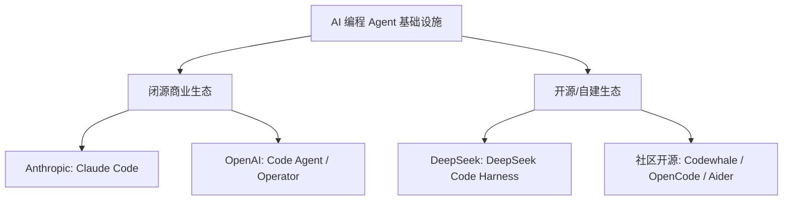

# DeepSeek Harness 团队与 AI Agent 编程基础设施深度分析报告

> **归档位置**: `06_行业观察/03_趋势与洞察/DeepSeek_Harness团队与AI_Agent编程基础设施深度分析报告.md`  
> **报告日期**: 2026-07-29  
> **关键词**: DeepSeek, Harness, Agentic Infrastructure, 崔添翼, Claude Code, Model + Harness = Agent

---

## 一、 事件背景与最新动态

### 1.1 DeepSeek 秘密组建 Harness 团队
2026 年上半年，DeepSeek（深度求索）公司在底层大模型（如 DeepSeek-V3 / R1）大获成功后，秘密组建了全新的 **Harness 研发团队**。该团队致力于将前沿模型能力转化为工业级、产品化的 AI Agent（智能体）基础设施。

### 1.2 内测传闻与发布预期
2026 年 7 月下旬，AI 开发者社区与社交平台流出 DeepSeek Harness 的小范围内部测试（内测）招募截图。
- **内测机制**: 首批测试面向小范围受邀开发者，入选者需签署严格的《保密承诺函》。
- **产品协同**: 市场普遍预期 DeepSeek Code Harness（暂定名）将与 DeepSeek V4 正式版协同发布或紧随其后推出，标志着 DeepSeek 从“基础大模型提供商”迈向“Model + Harness 全栈 Agent 基础设施提供商”的战略升级。

### 1.3 领军人物：崔添翼（前 Jane Street 资深架构师）
Harness 团队由 **崔添翼** 领军负责（于 2026 年 3 月加盟 DeepSeek）。
- **履历背景**:
  - **竞赛与著作**: 浙江大学计算机系毕业，ACM-ICPC 亚洲区 6 金得主，因撰写知名算法教程《背包九讲》在程序员与算法竞赛圈广为人知。
  - **华尔街量化经历**: 2013 年加入顶尖量化交易巨头 Jane Street Capital，工作长达 9 年；随后作为联合创始人创立量化投资机构 TSY Capital。
- **工程基因迁移**: 崔添翼拥有深厚的低延迟高并发系统、高鲁棒性交易引擎设计经验。由其带队表明 DeepSeek 在 Agent 研发上追求极致的**确定性工程控制、状态机严密性与沙箱安全**。
- **公开招聘与回应**: 自 2026 年 3 月起，崔添翼在社交平台公开为 Harness 团队招揽人才（招聘 Harness 研究员、工程师与 PM）；并曾公开回应“DeepSeek 不招外籍员工”的网络传闻，澄清要求能够使用中文办公（逻辑同美企要求英文办公一致），绝无国籍歧视。

---

## 二、 核心理念解构：`Model + Harness = Agent`

在 2026 年的 AI 工程范式中，行业达成高度共识：**单靠大模型（LLM）无法直接解决复杂的现实工程问题，必须依靠外壳工程（Harness）来实现模型从“聊天机器人”到“自主智能体”的跃迁。**

$$\text{Agent (智能体)} = \text{Model (智力底座)} + \text{Harness (工程外壳/载具)}$$

```
+-----------------------------------------------------------------------+
|                              Agent 系统                               |
|                                                                       |
|  +-----------------------------------------------------------------+  |
|  |                          Harness 基础设施                        |  |
|  |                                                                 |  |
|  |  +-------------------+  +-------------------+  +-------------+  |  |
|  |  | Context Engine    |  | Execution Sandbox |  | Tooling     |  |  |
|  |  | 上下文管理/检索   |  | 终端/代码沙箱     |  | AST/Git/Cli |  |  |
|  |  +-------------------+  +-------------------+  +-------------+  |  |
|  |  +-------------------+  +-------------------+  +-------------+  |  |
|  |  | Planning & Loop   |  | State Persistence |  | Self-Correction|  |
|  |  | 任务规划与闭环    |  | 状态持久化        |  | 运行时自我纠错 |  |
|  |  +-------------------+  +-------------------+  +-------------+  |  |
|  +-----------------------------------------------------------------+  |
|                                   ^                                   |
|                                   |  (API / Token Stream)             |
|                                   v                                   |
|  +-----------------------------------------------------------------+  |
|  |                          Model (基础模型)                        |  |
|  |                     DeepSeek-V3 / R1 / V4                        |  |
|  +-----------------------------------------------------------------+  |
+-----------------------------------------------------------------------+
```

### 2.1 什么是 Harness？
Harness（字面意为“马具/驾驭/载具”）是指围绕 LLM 封装的一套软件工程架构与运行时环境，负责管理智能体与外部物理世界（如文件系统、终端命令行、静态分析器、Git、API 等）的一切交互。

### 2.2 Harness 的六大核心模块

| 模块名称 | 核心功能与技术点 | 解决的核心痛点 |
|---------|-----------------|---------------|
| **1. Context Engineering (上下文工程)** | 依赖图提取、相关代码切片、AST 树解析、上下文窗口压缩与衰减管理 | 解决 Context Rot（长上下文注意力稀释）与 Token 成本膨胀 |
| **2. Tooling & CLI Integration (工具链集成)** | 提供终端命令执行、读写文件、Git 提交、代码重构 AST 等原生工具接口 | 使模型能够像人类程序员一样操作 IDE 和 Terminal |
| **3. Execution Sandbox (执行沙箱)** | 隔离运行环境（Docker/Wasm）、自动化单元测试与编译检查 | 保证代码自主调测时的系统安全性与结果可验证性 |
| **4. Planning & Loop Control (规划与闭环)** | 目标拆解（Task Decomposition）、Sub-agent 派生与多步执行循环 | 避免 LLM 在长路径任务中掉队或陷入盲目死循环 |
| **5. Self-Correction & Feedback (自我纠错)** | 捕获 Compiler Error、Linter Warning、Test Failure 并作为 Prompt 反馈给模型 | 形成“生成 -> 执行 -> 报错 -> 自我修复”的闭环 |
| **6. State Persistence & Memory (状态持久化)** | 跨 Session 历史记录、Checkpoint 恢复、中断自愈 | 支持持续数小时甚至跨天的长周期大型工程任务 |

---

## 三、 对标产品与竞局分析

### 3.1 对标 Anthropic Claude Code
- **Claude Code 的先发优势**: Anthropic 推出的 Claude Code 通过 CLI 原生集成、高性能 Agent 循环与工具打通，树立了终端 AI Agent 的标杆。
- **DeepSeek Code Harness 的后发切入点**:
  - **极致的成本优势**: 依赖 DeepSeek 高性价比的模型推理（API / 本地部署）。
  - **高确定性系统架构**: 引入 Jane Street 式的高频交易级别状态控制，减少 Agent 在大工程中的漂移（Drift）现象。
  - **开源/私有化能力**: 针对企业隐私敏感场景，提供本地/私有云可部署的 Agent 基础设施。

### 3.2 竞局现状对比



---

## 四、 对个人职业规划与技术选型的启示

### 4.1 从“Prompt 工程师”向“Agent Harness 工程师”演进
- **单纯调参/写 Prompt 的边际效应递减**: 随模型 Reasoning 能力增强，Prompt 技巧的重要性降低。
- **核心竞争力转向 Harness 工程**: 如何构建高质量的 Sandbox、设计鲁棒的 Agent Loop、管理高并发 Tool Execution、优化 Context Window 成为 AI 工程领域最核心的 P0 技能。

### 4.2 转码与AI工程技能树对齐

```
        +-------------------------------------------------------+
        |                 AI 工程师核心能力模型                   |
        +-------------------------------------------------------+
                                    |
            +-----------------------+-----------------------+
            |                                               |
  [底层/模型层] (P1)                               [工程/Harness层] (P0)
  - Transformer 架构理解                           - Shell/CLI 自动化 & 沙箱构建
  - LoRA/SFT 模型微调                              - AST 解析 & 代码图谱生成
  - API 调用与 Token 优化                         - Agent 多步 Loop & 状态机设计
                                                   - Context Engineering & RAG
```

---

## 五、 总结与后续观察点

1. **发布节点关注**: 重点关注 2026 年第三季度 DeepSeek V4 发布会及 Harness 产品的官方公测。
2. **开源动态追踪**: 观察 DeepSeek 是否会将 Harness 核心框架开源，这可能掀起继 DeepSeek-R1 后开源 Agent 基础设施的新一轮热潮。
3. **知识库联动**: 本报告已归档至 `06_行业观察/03_趋势与洞察/` 目录，需定期配合 `02_AI工程/05_AI辅助开发工作流/` 中的 OpenCode/Claude Code 工具链进行对比演练。
