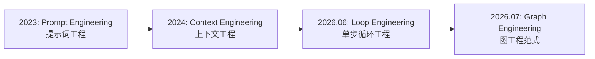

# Graph Engineering (图工程) 与 AI Agent 范式演进深度总结笔记

> **归档位置**: `06_行业观察/03_趋势与洞察/Graph_Engineering图工程与AI_Agent范式演进深度总结笔记.md`  
> **关联 PDF**: [Loop_Engineering已死_一文带你了解Graph_Engineering.pdf](./Loop_Engineering已死_一文带你了解Graph_Engineering.pdf)  
> **报告时间**: 2026 年 7 月 31 日  
> **关键词**: Graph Engineering, Loop Engineering, Agentic AI, LangGraph, Anthropic, ReAct 范式, 状态机, 确定性工程

---

## 零、 归档与前言

本笔记源于行业前沿报告 **《Loop Engineering 已死？一文带你了解 Graph Engineering》**（作者：lukiexing，发布于 2026 年 7 月 28 日），并结合了截至 2026 年 7 月底全球 AI Agent 领域的最新行业资讯与工程实践。

我们将原报告的核心思想、数学公式、对比图表以及 Anthropic / OpenAI / DeepSeek / 字节跳动等大厂在 Harness/Agent 编排领域的最新进展进行了系统性整合，旨在为 AI 工程师、转码者及系统架构师提供一份**关于“如何编程一群智能体”的终极实战指南**。

---

## 一、 现象与背景：从 Prompt 到 Loop，再到 Graph 的术语演进



### 1.1 270 万浏览引发的行业大讨论
- **事件起因**: 2026 年 7 月 17 日，OpenClaw 项目创始人 **Peter Steinberger** 在 X (Twitter) 上公开发文：
  > *"Are we still talking loops or did we shift to graphs yet?"*  
  > （我们还在聊循环 Loop 吗，还是已经转向图 Graph 了？）
- **行业呼应**: 该推文在一周内迅速突破 270 万次浏览，引爆了 XState 创始人 David Khourshid、Karan Singh 以及来自 Anthropic、LangChain 团队的技术大佬大讨论。
- **术语更迭脉络**:
  - **2026 年 6 月**: 行业热炒 **Loop Engineering (循环工程)**——由 Claude Code 负责人 Boris Cherny 和 Peter Steinberger 提出，核心观念是“程序员不该再写 Prompt，而该写包着 Prompt 的 REPL 循环 (Loop)”。
  - **2026 年 7 月**: 随着单 Agent 循环在大工程中频繁发生“上下文污染”和“既当运动员又当裁判”的溃败，工程界迅速迈向 **Graph Engineering (图工程)**。

---

## 二、 臃肿 Loop 的原罪：为什么单个循环无法支撑复杂工程？

在传统的单 Agent 循环（Loop）模式中，智能体在一个 `while` 循环里不断地 `ReAct` (Reasoning + Acting)。当任务变得复杂时，这种单一 Loop 会暴露三大致命原罪：

```
臃肿 Loop 模式:
[用户需求] --> (模型: 搜资料 -> 改代码 -> 自己审查 -> 再搜资料 -> 上下文爆炸) --> [既当选手又当裁判 / 容易死循环]
```

### 2.1 原罪一：既当运动员，又当裁判 (选手与审稿人同一个上下文)
让写代码的智能体在它自己的上下文记录里审查自己的代码，模型几乎 100% 会盖章通过。这种“自我盲目自信”是单 Agent 极易写出破坏性 Bug 的根源。

### 2.2 原罪二：Context Rot (上下文腐烂与污染)
随着 Loop 循环圈数增加，原始网页搜索结果、乱码报错、写了一半的草稿全部混杂在同一个 Context 窗口里。上下文越滚越脏，模型在第 10 轮循环时甚至会忘记最初的目标。

### 2.3 原罪三：顺序串行执行的低效
单 Loop 只能像串行流水线一样一个信源、一个文件地处理，无法实现并发探索（Fan-out），导致延时（Latency）和 Token 消耗急剧膨胀。

---

## 三、 Graph Engineering 的核心解构：节点、边与确定性

图工程（Graph Engineering）的核心逻辑是：**把“控制流”从大模型的嘴里收回来，用硬编码的图结构（节点 + 条件边）来控制，让大模型只专注在节点内部做局部推理。**

$$\text{Graph System} = \text{Nodes (模型/代码智能体)} + \text{Edges (状态转移/条件路由)} + \text{Shared State (共享状态)}$$

```
图工程 (Graph Engineering) 架构:

                   +--------------------+
                   | 路由节点 (Router)   |
                   +--------------------+
                             |
             +---------------+---------------+
             | (Fan-out)                     | (Fan-out)
             v                               v
   +--------------------+          +--------------------+
   | 研发节点 A (Node A) |          | 研发节点 B (Node B) |
   +--------------------+          +--------------------+
             |                               |
             +---------------+---------------+
                             | (Fan-in)
                             v
                   +--------------------+
                   | 独立验证器 (Verifier)| <--- (干净上下文: 专门挑错)
                   +--------------------+
                             |
              [通过?] -------+------- [不通过?]
                 |                        |
                 v                        v
            (进入下一步)             (带报错打回修正)
```

### 3.1 核心元素拆解

| 概念/组件 | 作用与技术点 | 解决的核心痛点 |
|----------|-------------|---------------|
| **Node (节点)** | 负责具体局部任务的独立 Agent 或纯 Python/Rust 代码块 | 保持局部上下文独立干净，避免全局污染 |
| **Edge (边 / 条件边)** | 预定义的条件路由逻辑（代码控制，非模型控制） | 保证系统流程的可预测性、可治理与可审计 |
| **Fan-out (扇出)** | 将大任务并发分发给多个子节点同时探索 | 极大缩短长任务的串行等待时间 |
| **Fan-in (扇入)** | 将多个子节点的执行结果合并归并 | 汇总多路探索结果，提炼最优解 |
| **Verifier (独立验证器)** | 在**全新的干净上下文**中专门试图推翻前一个结论的节点 | 彻底解决“既当运动员又当裁判”的自嗨盲区 |
| **Router (分诊路由)** | 像医院分诊台一样，根据任务风险度分流至不同检查路径 | 避免轻量任务过度消耗 Token |

### 3.2 图工程的关键铁律：“让模型的判断力落在节点上，让代码的可靠性落在边上”

- **节点（Node）**：适合放随机性、需要推理判断的活（如理解自然语言需求、写代码逻辑）。
- **边（Edge）与校验**：必须由确定性的死代码兜底（如正则校验、JSON 格式解析、跑单元测试、排序去重）。
- **现实锚点警告**：如果一张图里所有的节点都在互相引用模型生成的文本结论，而没有一个节点真正去运行测试、调用真实的 API 或确认钱是否到账，那它只是一台更精致的“幻觉工厂”。

---

## 四、 核心框架对比：LangGraph vs CrewAI vs AutoGen vs Google ADK

报告与 DataCamp 2026 权威对比显示，主流 Agent 框架在图工程演进中呈现出明显的定位分化：

| 框架名称 | 研发厂商 | 编排模型 | 状态管理与特色 | 相同任务 Token 消耗 | 适合场景 |
|---------|---------|---------|----------------|-------------------|---------|
| **LangGraph** | LangChain 生态 | **有向图 + 条件边** | **内置 Checkpointer + 持久化执行 (Durable Execution)** | **约 2000 Tokens** | **长时运行、需审计、需回滚与断点续传的企业生产管线** |
| **CrewAI** | 开源生态 | 角色化 Crews | 任务输出序列传递 | 约 3500 Tokens | 规范化的角色分工协同 |
| **AutoGen** | 微软 (Microsoft) | 对话式 GroupChat | 对话历史为主 | 约 8000 Tokens | 多模型对话协调的探索性任务 |
| **Google ADK** | Google | 结构化图架构 | 分层协调 + A2A (Agent-to-Agent) 协议 | — | Code-first、企业级部署 (Vertex AI) |

### 4.1 为什么 LangGraph 成为企业生产的事实标准？
1. **Token 极度节省 (2000 vs 8000)**：LangGraph 把智能体之间的“自由对话”提炼为了“状态转换 (State Transitions)”，省去了 Agent 之间互相转述背景的大段无用文本。
2. **杀手锏：持久化执行 (Durable Execution) 与 Checkpointer**：
   - **人在回路 (Human-in-the-loop)**：图可以在任意节点暂停，等待人类审批修改后再继续。
   - **时间旅行 (Time Travel)**：可回到任意历史 Super-step 重新放映或分叉出新路径。
   - **待写入 (Pending Writes)**：在同一 Super-step 中若节点 A 成功、节点 B 失败，恢复时无需重跑节点 A。

---

## 五、 真实工业落地案例

### 5.1 LinkedIn SQL Bot
- **场景**: 几千名不懂代码的员工用自然语言查询大数据仓库。
- **图架构**: 路由 Agent 判断数据域 -> 领域专家 Agent 提炼字段 -> SQL 编写 Agent -> 独立自纠错 Agent 跑语法校验。
- **效果**: 内部查询准确满意度飙升至 **95%**。

### 5.2 Uber 5000 工程师大代码库迁移
- **场景**: 面对 5000 名工程师、上亿行代码的跨语言重构。
- **图架构**: 主主管图协调全局 -> 子图给不同语言/仓库派生专用 Agent -> 提交前触发冲突解决图。
- **效果**: 凭借 Checkpointer 扛住 CI 抽风与维护中断，累计节省 **21,000+ 工程小时**。

### 5.3 Anthropic Multi-Agent Research System
- **官方数据**:
  - 多 Agent 编排系统在深度研究评测上超过单 Agent **+90.2%**。
  - Token 消耗约为普通对话的 **15 倍**。
  - 仅 Token 增加这一项，就解释了性能提升方差的 **80%**。

---

## 六、 什么时候用 Graph，什么时候用 Loop？

Anthropic 在《Building Effective Agents》中给出了最权威的三把尺子：

```
                         [收到新工程任务]
                                |
             +------------------+------------------+
             |                                     |
    [目标单一 / 路径明确 / 场景简单]        [命中以下三大信号之一?]
             |                                     |
             v                                     v
       【选择单 Loop】                     【选择 Graph 图工程】
    - 快速脚本                             1. 产生 >1000 Token 污染信息 (上下文保护)
    - 单文件修改                           2. 任务可并行分发 (Fan-out 探索)
    - 每天检查 CI 日志                     3. 不同步骤需专业化工具/独立验证器
```

---

## 七、 从 ReAct 到 Graph：螺旋上升的系统论

很多资深工程师争论：**Graph Engineering 是不是退回到了 ReAct 之前的传统死板工作流？**

答案是：**形似，神不似。**

- **第一代（传统死板工作流）**: 路径是死的，节点里的代码也是死的，遇到预料之外的情况直接崩溃。
- **第二代（纯 ReAct / 单 Loop）**: 全程依靠 LLM 边想边做，极其灵活，但控制流泡在杂乱的对话里，不可控、不可审计。
- **第三代（Graph Engineering 图工程）**: **预定义的边框住动态的节点**。外层的边是硬编码（稳），节点里面住着能自主推理的 Agent（活）。

```
        +-------------------------------------------------------+
        |                 Graph 融合架构                         |
        |                                                       |
        |   [硬编码的边与状态机 (稳/可治理/可审计)]               |
        |      |                                                |
        |      v                                                |
        |   [节点内运行的推理 Agent (活/自主应对复杂细节)]      |
        +-------------------------------------------------------+
```

---

## 八、 总结与工程师落地三原则

1. **第一原则：别为了图而图**。如果一个清晰的单 Loop 就能搞定，绝不整复杂。先画一张能在餐巾纸上说清的小图。
2. **第二原则：图的价值来自“确定性”，而非智能体数量**。让模型的判断力落在节点上，让代码的可靠性落在边上，配一双独立挑刺的“验证器”眼睛。
3. **第三原则：图必须有现实锚点**。跑过真实的单元测试、成功发起 API 扣款、代码无冲突合入，才是检验图工程的唯一硬标准。

---

> **知识库关联文档**:
> - [中国主流AI大厂Harness技术进展与Agent评级报告_2026.md](./中国主流AI大厂Harness技术进展与Agent评级报告_2026.md)
> - [DeepSeek_Harness团队与AI_Agent编程基础设施深度分析报告.md](./DeepSeek_Harness团队与AI_Agent编程基础设施深度分析报告.md)
> - [Context-Rot-LLM长上下文性能研究-核心摘要.md](./Context-Rot-LLM长上下文性能研究-核心摘要.md)
