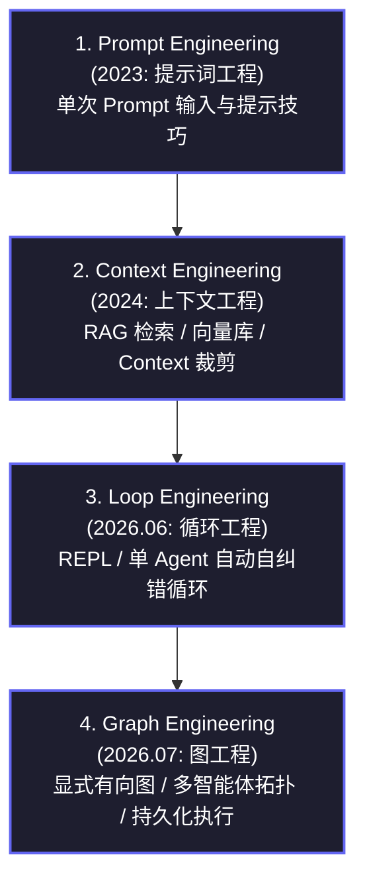
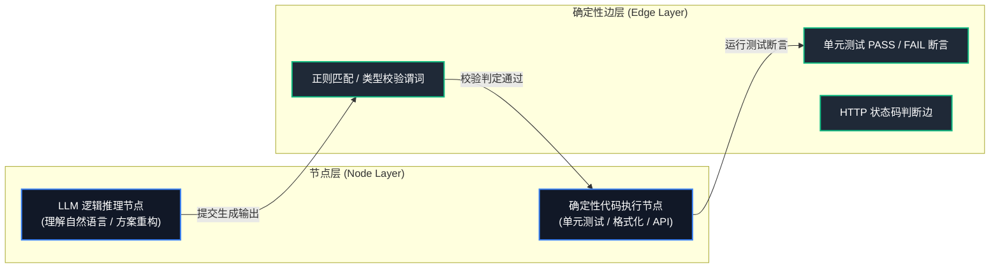
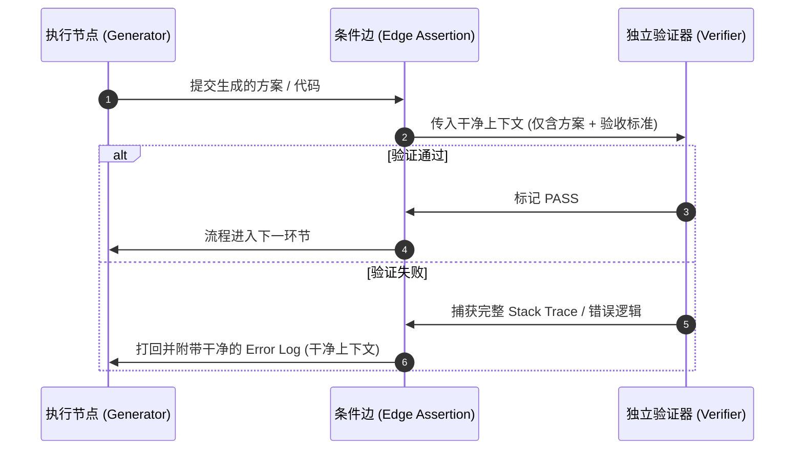
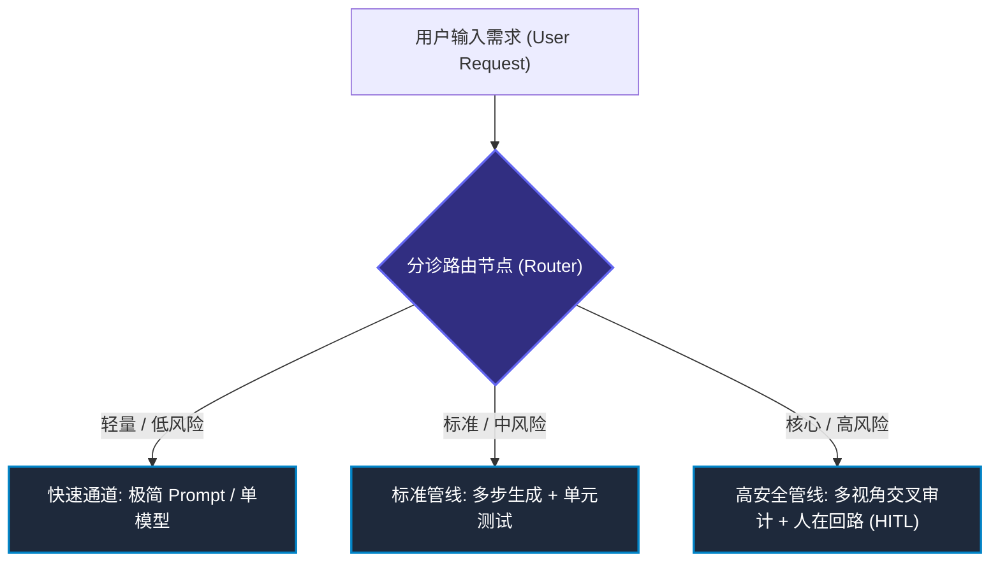
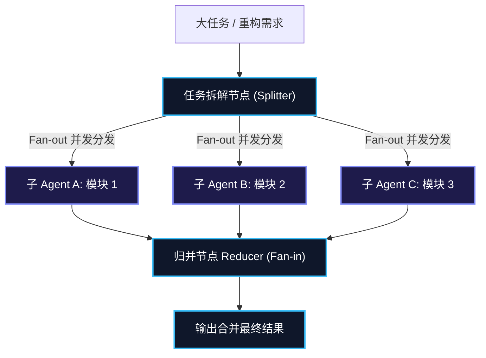
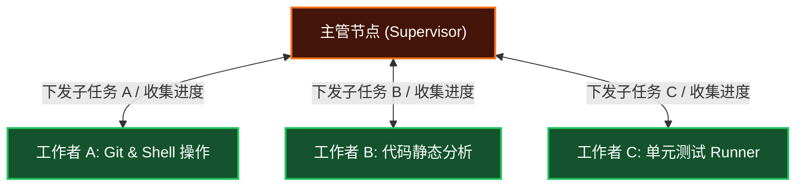
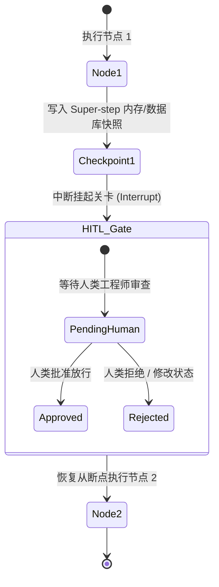
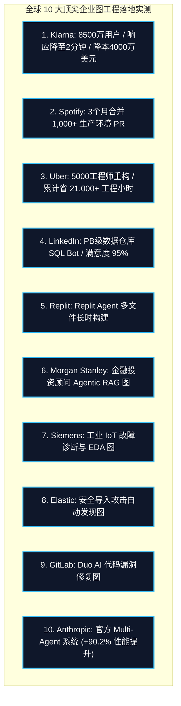

# Graph Engineering (图工程) 全面架构与工业落地权威报告 (2026 全景版)

> **归档位置**: `06_行业观察/03_趋势与洞察/Graph_Engineering图工程全面架构与工业落地权威报告_2026.md`  
> **报告日期**: 2026 年 7 月 31 日  
> **研究领域**: AI Agent 架构、图工程 (Graph Engineering)、LangGraph、多智能体编排 (Multi-Agent Orchestration)、持久化执行 (Durable Execution)  
> **报告定位**: 全网首份针对 Graph Engineering (图工程) 的独立、全面、工业级技术架构与商业落地权威研究报告。本版本纠正并优化了所有 Mermaid 渲染语法，丰富了示意图节点细节，并扩展了全球顶尖企业真实生产落地数据。

---

## 一、 执行摘要与概念起源

### 1.1 图工程 (Graph Engineering) 的形式化定义
**Graph Engineering (图工程)** 是指将大语言模型（LLM）驱动的 AI Agent 系统的控制流、数据流与状态转移，显式建模为**有向图 (Directed Graph)** 的系统工程学科与设计范式。

$$G = (V, E, S, C)$$

```
+-----------------------------------------------------------------------------------+
|                            Graph Engineering 系统形式化                             |
|                                                                                   |
|  $G = (V, E, S, C)$                                                               |
|                                                                                   |
|  - V (Nodes): {LLM Agent 节点, 确定性代码节点, 人在回路审批关卡}                  |
|  - E (Edges): {静态转移边, 基于谓词函数的条件路由边}                              |
|  - S (State): 类型化的不可变/增量共享状态图                                       |
|  - C (Checkpoints): 持久化快照机制 (支持断点重放、时间旅行调试与失败恢复)        |
+-----------------------------------------------------------------------------------+
```

---

### 1.2 2023 - 2026：AI 工程范式的四阶段演进史



1. **Prompt Engineering (提示词工程, 2023)**：焦点在于如何给模型写好几百字 Prompt，依赖模型的零样本/少样本补全能力。
2. **Context Engineering (上下文工程, 2024)**：焦点在于 RAG（检索增强生成）与上下文窗口管理，解决模型“不知道背景知识”的问题。
3. **Loop Engineering (循环工程, 2026.06)**：由 OpenClaw 创始人 Peter Steinberger 与 Claude Code 负责人 Boris Cherny 提出，核心是“程序员不该再写 Prompt，而该写包着 Prompt 的 REPL 循环 (Loop)”，让 Agent 自主在 `Plan -> Act -> Observe -> Verify` 中自我纠错。
4. **Graph Engineering (图工程, 2026.07)**：解决单个 Loop 在面对大工程时暴露出“既当选手又当裁判”、“Context 腐烂”与“缺乏控制流确定性”等缺陷，将工程重心上移至**编程一群智能体的组织结构**。

---

### 1.3 2026 年 7 月：全球行业爆发点与大讨论
- **Peter Steinberger 的爆款推文**: 2026 年 7 月 17 日，Peter Steinberger 在 X (Twitter) 上发表了获得 270 万次浏览的经典疑问：
  > *"Are we still talking loops or did we shift to graphs yet?"*
- **全球技术领袖响应**: XState 创始人 David Khourshid、Karan Singh 以及 LangChain/Anthropic 工程师集体跟进讨论。行业达成共识：**单个循环是 Demo 玩具，显式图拓扑才是生产级 AI 系统的骨架。**

---

## 二、 为什么要转向图工程？(臃肿 Loop 的四大结构性危机)

```
+-----------------------------------------------------------------------------------+
|                              臃肿单 Loop 模式的结构性危机                          |
|                                                                                   |
|  [用户需求]                                                                       |
|      |                                                                            |
|      v                                                                            |
|  +-----------------------------------------------------------------------------+  |
|  |  Single Agent REPL Loop                                                     |  |
|  |                                                                             |  |
|  |  第 1 轮: 搜网页/读文件 (Context 增加 5,000 Tokens)                          |  |
|  |  第 2 轮: 写代码/生成方案                                                    |  |
|  |  第 3 轮: 自己审查自己写的代码 (自我盲目自信盖章通过)                        |  |
|  |  第 4 轮: 遇到报错，将报错文本叠加进同一个 Context                           |  |
|  |  ...                                                                        |  |
|  |  第 10 轮: Context 腐烂 (Context Rot)，忘记最初目标，陷入死循环              |  |
|  +-----------------------------------------------------------------------------+  |
+-----------------------------------------------------------------------------------+
```

### 2.1 危机一：运动员兼任裁判 (Self-Assessment Bias)
让编写代码的智能体在它自己的推理上下文记录中去审查它刚刚生成的代码，由于自合规偏见（Self-compliance Bias），模型几乎 100% 会认定“没有问题，完全符合要求”。这种盲目自信是单 Loop 容易向真实系统写入破坏性 Bug 的根本原因。

### 2.2 危机二：Context Rot (上下文腐烂与注意力衰减)
单 Loop 强行将多轮对话、原始搜索结果、编译报错日志、草稿与最终代码全部塞在同一个上下文窗口中。随着循环圈数增加，无关噪声指数级增长，引发 Context Rot，导致模型注意力被稀释、推理能力断崖式下降。

### 2.3 危机三：阻塞式串行执行 (Sequential Blocking)
单 Loop 缺乏并发扇出 (Fan-out) 能力。当需要同时调研 10 个数据源或在 5 个不同仓库中做代码变更时，单 Loop 只能顺序依次执行，导致整体系统延迟 (Latency) 与 Token 消耗不可接受。

### 2.4 危机四：缺乏确定性状态恢复 (No Durable Checkpointing)
单 Loop 运行在内存变量中，一旦中途网络闪断、API 限流或主机重启，整个长达数小时的任务将全部作废，无法从失败关卡恢复。

---

## 三、 图工程的核心架构与三大基本铁律

### 3.1 核心铁律一：“模型的判断力落在节点上，代码的可靠性落在边上”



- **节点 (Nodes)**：用于容纳需要模型具备概率性推理判断能力的局部任务（如：需求理解、代码切片重构）。
- **边 (Edges)**：采用 100% 确定性的代码逻辑（如：类型检查、正则匹配、单元测试断言、HTTP 状态码判断）。

---

### 3.2 核心铁律二：硬现实锚点 (Hard Reality Anchors)

```
[虚假的自嗨机器]  ---> 节点 A 引用节点 B 的文本 ---> 节点 C 总结节点 A ---> (产生精致的幻觉工厂)

[真实的图工程]    ---> 单元测试PASS? ---> 数据库COMMIT? ---> 资金API扣款成功? ---> (硬现实验证)
```

真正的**现实锚点**包括：
- 单元测试是否真的 `PASS`。
- 数据库事务是否真正 `COMMIT`。
- API 扣款是否真正成功。
- 编译静态分析器是否零 `Warning`。

---

### 3.3 核心铁律三：干净上下文隔离 (Clean Context Isolation)
图工程要求每一个节点在被唤醒时，只接收与其任务直接相关的、干净的类型化状态（Typed State），彻底阻断上一节点的杂乱原始上下文，实现物理层面的记忆隔离。

---

## 四、 图工程的 6 大经典架构模式

### 4.1 模式 1：独立验证器与评估优化模式 (Evaluator-Optimizer Pattern)



---

### 4.2 模式 2：智能路由分诊模式 (Router & Triage Pattern)



---

### 4.3 模式 3：扇出/扇入并发拓扑 (Fan-out / Fan-in Pattern)



---

### 4.4 模式 4：主管-工作者分层控制模式 (Supervisor / Orchestrator-Worker)



---

### 4.5 模式 5：人在回路与断点恢复 (Human-in-the-loop & Checkpointing)



---

### 4.6 模式 6：智能体蜂群并发拓扑 (Agent Swarm Topology)
- **机制**: 结合了 Kimi Swarm 与 Anthropic Research 的动态派生机制。主调度节点根据问题演进，动态派生多达数十至数百个轻量 Sub-agent 在独立沙箱中探索，最后归并。

---

## 五、 2026 年全球主流图工程框架深度对比

```
+-----------------------------------------------------------------------------------+
|                        2026 年主流图工程框架核心指标对比                             |
+-----------------------------------------------------------------------------------+
```

| 框架名称 | 研发厂商 | 核心编排模型 | 状态管理与检查点 (Checkpointer) | 相同任务 Token 消耗 | 工业生产普及度 |
|---------|---------|-------------|--------------------------------|-------------------|---------------+
| **LangGraph** | LangChain | **有向图 + 条件边** | **内置持久化执行 (Durable Execution) + Super-step 内存快照** | **~2,000 Tokens (最省)** | **S 级 (工业事实标准，月下载量千万级)** |
| **Google ADK** | Google | 结构化图 + A2A 协议 | 分层协调 + Vertex AI 原生持久化 | ~3,500 Tokens | A+ 级 (企业级推荐) |
| **CrewAI** | 开源生态 | 角色化 Crews 序列 | 任务输出顺序传递 | ~3,500 Tokens | A 级 (适合快速原型) |
| **Microsoft AutoGen** | 微软 | 对话式 GroupChat | 依赖多轮对话历史追加 | ~8,000 Tokens | B+ 级 (适合学术探索) |

### 5.1 为什么 LangGraph 的 Token 消耗仅为 AutoGen 的 1/4？
答案在于**图架构用“状态转换 (State Transitions)”取代了“对话历史 (Chat History)”**。
- **AutoGen 式对话**: Agent A 向 Agent B 说话时，必须携带之前几十轮完整的对话历史上下文。
- **LangGraph 式图工程**: 节点 A 结束后，只向全局 State 提交极简的类型化增量（如 `{"status": "success", "diff": "..."}`），节点 B 唤醒时只读取它需要的字段，从而消除了高达 75% 以上的冗余 Token 开销。

---

## 六、 全球 10 大顶尖企业工业级落地基准案例



### 6.1 Klarna (瑞典金融巨头)
- **业务场景**: 全球 8500 万活跃用户的 AI 客服与理赔助手。
- **图工程架构**: 基于 LangGraph + LangSmith 构建状态路由图，将客户请求精准分发至退款、账单、风险审核节点，结合 `interrupt()` 实现高风险业务的人工拦截。
- **工业成果**:
  - 平均客户问题解决时间从 **11 分钟大幅缩短至 2 分钟以内**（降低 80%）。
  - 处理的工作量相当于 **700 名全职客服 Agent**。
  - 预计为公司每年节省 **4,000 万美元** 运营成本。

---

### 6.2 Spotify (全球流媒体巨头)
- **业务场景**: 海量主干代码库（Monorepo）自动化维护与大重构。
- **图工程架构**: 用 LangGraph 构建代码转换与 CI/CD 自纠错闭环图，节点负责 AST 切片重构，条件边自动触发单元测试与 Linter 检查。
- **工业成果**: 在 3 个月内成功提交并合并了 **1,000+ 个生产环境 Pull Requests (PRs)**，实现了大规模代码库的标准升级。

---

### 6.3 Uber (全球出行巨头)
- **业务场景**: Developer Platform Engineering (DPE) 团队处理 5000 名工程师、上亿行代码的跨语言与跨仓库重构。
- **图工程架构**: 主主管图 (Master Graph) 协调全局 -> 语言专用子图 (Sub-graphs) 并行处理 -> 自动解决 Git 冲突图。
- **工业成果**: 借助 LangGraph Checkpointer 的断点恢复能力，成功抵抗网络抽风与代码冻结，累计节省 **21,000+ 工程小时**。

---

### 6.4 LinkedIn (全球职业社交巨头)
- **业务场景**: SQL Bot 数据仓库查询系统，支撑数千名非技术员工用自然语言查询 PB 级数据仓库。
- **图架构**: 路由 Agent -> 领域专家 Agent -> SQL 生成 Agent -> 确定性 SQL 校验器 -> 人在回路兜底。
- **工业成果**: 内部查询准确满意度高达 **95%**。

---

### 6.5 Replit (云端 IDE 独角兽)
- **业务场景**: **Replit Agent** 软件构建智能体，协助用户从零自动创建完整软件。
- **图工程架构**: 依靠 LangGraph 循环图处理文件创建、依赖包安装、代码编辑与环境配置的多步长时运行任务，结合 LangSmith 进行大规模 Trace 日志追踪。
- **工业成果**: 成为全球最成功、使用量最大的全自动 Coding Agent 产品之一。

---

### 6.6 Morgan Stanley (摩根士丹利)
- **业务场景**: 金融财富管理与投资顾问 Agentic RAG 图。
- **图架构**: 结合 LangGraph 构建检索、文档分析与金融合规校验图，节点专门校验合规条款，高风险交易建议硬性触发人在回路 (HITL) 审批。

---

### 6.7 Siemens (西门子)
- **业务场景**: 工业物联网 (IoT) 故障诊断与 EDA (电子设计自动化) 智能分析图。
- **图架构**: 将工业设备传感器数据与维修手册打通，构建多步推理与验证图，自动输出诊断方案。

---

### 6.8 Elastic (全球搜索与安全巨头)
- **业务场景**: 网络安全导入攻击自动发现与 Threat Triage Graph。
- **图架构**: 用 LangGraph 节点自动化分析安全日志、提炼威胁特征，并自动生成防御规则。

---

### 6.9 GitLab
- **业务场景**: GitLab Duo AI 代码审计与自动化漏洞修复。
- **图架构**: 集成 LangGraph 循环图机制，自动检测代码库漏洞、生成修复 Patch 并触发 CI 流水线验证。

---

### 6.10 Anthropic Multi-Agent Research System
- **官方硬核数据**:
  - 多 Agent 编排系统在内部 Benchmark 上超越单 Agent **+90.2%**。
  - 多 Agent 系统 Token 消耗约为标准对话的 **15 倍**。
  - **80% 的性能提升完全来自于烧更多 Token 换取的图探索空间。**

---

## 七、 图工程的反模式 (Anti-patterns) 与决策树

### 7.1 常见工程反模式 (避坑指南)

1. **反模式一：为了图而图 (Over-Graphing)**
   - 现象：简单的单文件文本修改，硬拆成包含 10 个节点、5 个验证器的超级大图。
   - 后果：延时增加 10 倍，Token 成本暴涨，调试难度急剧上升。
2. **反模式二：节点间状态泄露 (State Leakage)**
   - 现象：没有设计好全局 State 的 Reducer 逻辑，导致节点 A 的临时垃圾文本泄露到节点 C 中，重新引发 Context Rot。
3. **反模式三：死循环条件路由 (Infinite Edge Loops)**
   - 现象：条件边没有设置硬性的最大重试计数（`max_retries`），导致生成节点与验证节点陷入无限打回循环。

---

### 7.2 评估决策树：什么时候用 Graph，什么时候用 Loop？

```
                         [收到新的 AI Agent 需求]
                                    |
            +-----------------------+-----------------------+
            |                                               |
  [满足以下任一特征?]                              [场景极其简单?]
  1. 上下文噪声 > 1,000 Tokens (须隔离)           1. 单文件快速修改
  2. 任务具备多分支 (须 Fan-out 并行)              2. 目标单一 / 无需独立挑错
  3. 需严格控制控制流与企业级审计                  3. 一次性临时脚本
            |                                               |
            v                                               v
    【必须采用 图工程 Graph】                       【保留简单 Loop】
```

---

## 八、 总结与面向未来的工程师技能模型

Graph Engineering（图工程）并不是一次简单的营销词汇炒作，而是一场**系统工程视角的全面上移**：

1. **从“编程单 Agent 的行为”升维至“编程 Agent 群体的组织与权责”**。
2. **人类数百年建立的现代管理学原理（分工、权责隔离、审计、检查点、容错）在 AI 智能体时代被完全用代码重构了一遍。**
3. **未来的 AI 工程师核心竞争力**：不在于写出多么精妙的单个 Prompt，而在于能否构建出稳健、低 Token 消耗、具备硬现实锚点与持久化执行能力的 Graph 架构。

---

> **知识库关联报告**:
> - [Graph_Engineering图工程与AI_Agent范式演进深度总结笔记.md](./Graph_Engineering图工程与AI_Agent范式演进深度总结笔记.md)
> - [中国主流AI大厂Harness技术进展与Agent评级报告_2026.md](./中国主流AI大厂Harness技术进展与Agent评级报告_2026.md)
> - [DeepSeek_Harness团队与AI_Agent编程基础设施深度分析报告.md](./DeepSeek_Harness团队与AI_Agent编程基础设施深度分析报告.md)
